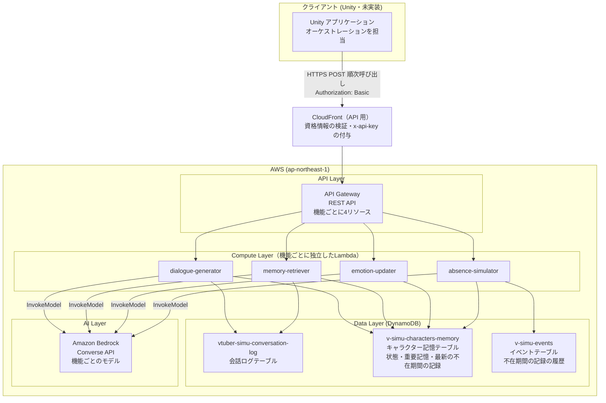
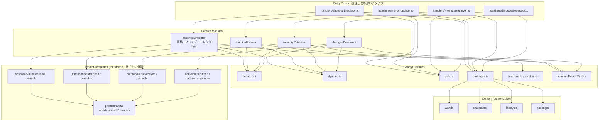
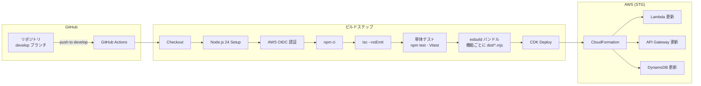
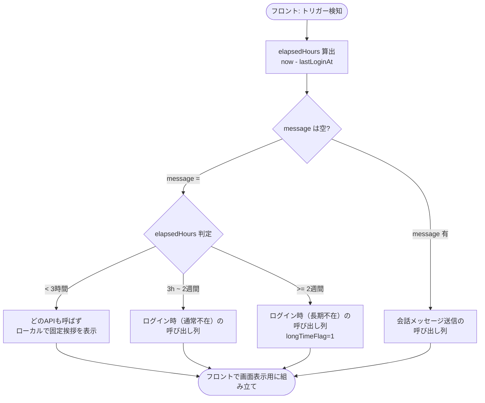
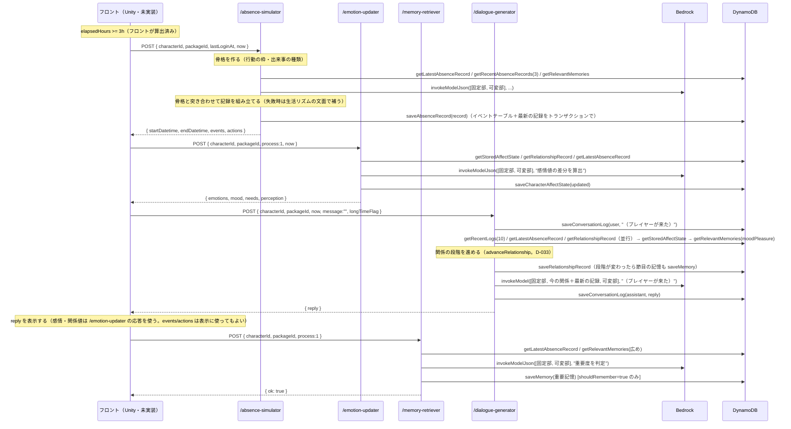
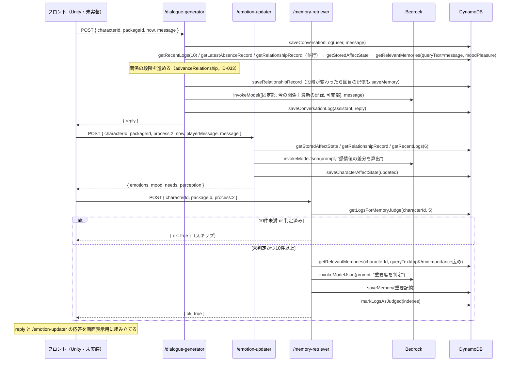
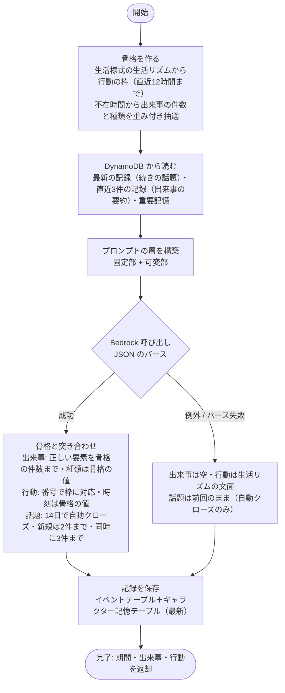
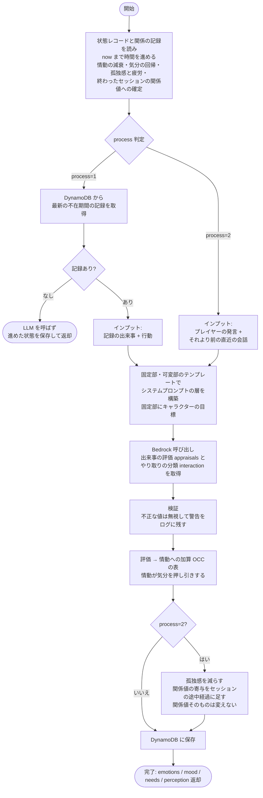
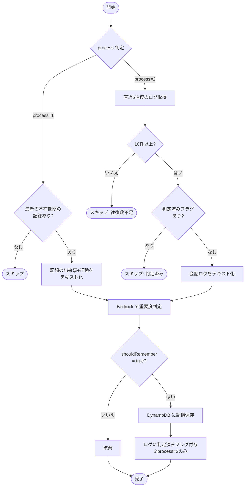

# VTuber Simulator API

VTuber キャラクターとのチャットインタラクションを提供するサーバーレス API。プレイヤーの不在時間に基づいてキャラクターの世界をシミュレートし、感情・関係値を持つキャラクターとの自然な対話を実現する。

`docs/spec/api/` 配下にあった仕様ドキュメント（overview / architecture / data-model / flow / api-spec）を、このフォルダの README に統合したもの。

## 技術スタック

| カテゴリ | 技術 |
|---------|------|
| ランタイム | Node.js 24.x (AWS Lambda) |
| 言語 | TypeScript (ESM) |
| ビルドツール | esbuild |
| テスト | Vitest（単体テスト。`test/unit/`） |
| LLM | Amazon Bedrock (Converse API)。機能ごとにモデルを使い分ける（下の「LLM のモデル」） |
| データベース | Amazon DynamoDB |
| API ゲートウェイ | Amazon API Gateway (REST API) |
| IaC | AWS CDK (TypeScript) |
| CI/CD | GitHub Actions (OIDC 認証。CI のロールは CDK のブートストラップのロールを引き受ける権限だけを持つ。D-036) |
| テンプレートエンジン | Mustache |
| リージョン | ap-northeast-1 (東京) |

## ディレクトリ構成

```
api/
├── .github/workflows/deploy-stg.yml   # CI/CD パイプライン（STG）
├── content/                            # キャラクター×世界観パッケージのデータ（JSON）
│   ├── worlds/                         # 世界観
│   ├── characters/                     # キャラクター（設定・口調の例文を含む）
│   ├── lifestyles/                     # 生活様式（生活リズム・出来事の種類。不在期間のシミュレーションで使用）
│   └── packages/                       # 世界観×キャラクター×生活様式の組み合わせ（フロントが選ぶ単位）
├── dist/                               # ビルド成果物（機能ごとに <name>.mjs ＋ content/ のコピー）
├── infra/                              # CDK インフラ定義
│   ├── bin/                            # CDK エントリーポイント
│   ├── lib/
│   │   ├── vtuber-simulator-stack.ts   # メインスタック（Lambda x4＋`/characters`・`/packages`・デバッグ用, API GW, DynamoDB）
│   │   └── github-oidc-stack.ts        # GitHub OIDC 認証スタック
│   ├── cdk.json / package.json / tsconfig.json
├── scripts/
│   ├── clear-tables.mjs                # テーブルクリアスクリプト
│   ├── copy-content.mjs                # content/ を dist/content/ にコピー（npm run build から実行）
│   └── test-runner.ts                  # 実AWS向けの手動実行スクリプト
├── src/
│   ├── handlers/                       # Lambda エントリーポイント（機能ごとに1ファイル）
│   │   ├── absenceSimulator.ts
│   │   ├── emotionUpdater.ts
│   │   ├── memoryRetriever.ts
│   │   ├── dialogueGenerator.ts
│   │   ├── testerCharacters.ts         # GET/POST /characters
│   │   ├── packageCatalog.ts           # GET /packages
│   │   └── debugCharacterState.ts      # POST /debug-character-state（デバッグ専用。stg のみ）
│   ├── types.ts                        # 型定義
│   ├── absenceSimulator/{index.ts, skeleton.ts, actionSlots.ts, eventKindSelection.ts, prompt.ts, modelOutput.ts, prompts/}  # 不在期間のシミュレーション
│   ├── emotionUpdater/{index.ts, prompt.ts, prompts/}      # 感情値更新
│   ├── memoryRetriever/{index.ts, prompt.ts, prompts/}     # 重要記憶管理
│   ├── dialogueGenerator/{index.ts, prompt.ts, prompts/}   # セリフ生成
│   ├── testerCharacters/               # テスターのキャラクターの一覧・作成
│   ├── packageCatalog/                 # パッケージ（キャラクター×世界観）の一覧
│   ├── debugCharacterState/index.ts    # 感情・関係値の状態の読み取り・書き換え（デバッグ専用）
│   ├── promptPartials/{index.ts, world.mustache, speechExamples.mustache}  # 各テンプレート共有のパーシャル
│   └── lib/{bedrock.ts, modelProfiles.ts, dynamo.ts, packages.ts, utils.ts, timezone.ts, random.ts, absenceRecordText.ts}
├── test/
│   ├── events/                         # Lambda コンソール用のテストイベント（廃止済み `/chat` 前提のまま古い）
│   ├── unit/                           # Vitest の単体テストコード（src/ と同じフォルダ構成）
│   └── ai-response/                    # AI 応答テスト（npm run test:ai。モデル・プロンプトの比較）
├── vitest.config.ts                    # Vitest 設定（.mustache 変換プラグイン、CONTENT_DIR 等）
└── package.json
```

## アーキテクチャ

機能（`absenceSimulator`/`emotionUpdater`/`memoryRetriever`/`dialogueGenerator`）ごとに独立した Lambda + API エンドポイントを公開する構成。**「どの処理をどの順で呼ぶか」を決めるオーケストレーションはバックエンドではなくフロントエンド（Unity、未実装）の責務**であり、バックエンド側にはもうプロセス分岐ロジックは存在しない（旧 `processChat.ts`/単一 `POST /chat` は廃止済み）。各 Lambda は「リクエストを受け取り、対応する機能を実行し、結果を返す」だけの薄いエンドポイントになっている。

ただし、エンドポイント間で受け渡すデータ（不在期間の出来事・行動）は DynamoDB に保存し、後段が読む。フロントは前段の出力を後段に中継しない（2026-09-19 から。経緯は [`.notes/done/absence-simulation-roadmap.md`](../.notes/done/absence-simulation-roadmap.md)）。

### 主要コンポーネント

| モジュール | 役割 |
|-----------|------|
| `handlers/*.ts` | Lambda エントリーポイント（機能ごとに1ファイル）。リクエスト解析・正規化・レスポンス生成のみを行う薄いアダプタ |
| `absenceSimulator` | 不在期間のシミュレーション。骨格（行動の枠・出来事の種類・続きの話題）をサーバーが決め、内容を LLM が書き、記録として保存する（旧 `eventResolver`・`actionPlanner` を統合） |
| `emotionUpdater` | 最新の不在期間の記録（process=1）／プレイヤー発言（process=2）を元に感情・関係値を LLM で更新 |
| `memoryRetriever` | 最新の不在期間の記録（process=1）／直近の会話（process=2）を LLM で判定し、重要な出来事を長期記憶として保存 |
| `dialogueGenerator` | 感情・関係値、重要記憶、直近の会話、最新の不在期間の記録を統合し、キャラクターのセリフを LLM で生成 |
| `lib/packages.ts` | リクエストの `packageId` から、`content/` の世界観・キャラクター・生活様式を読み込む |
| `lib/absenceRecordText.ts` | 不在期間の記録を、後段3機能のプロンプト用の文章にする |
| `promptPartials` | 世界観・口調の例文を描画する共有パーシャル。各機能の固定部のテンプレートから読み込む |

### キャラクター×世界観パッケージ

キャラクター固有・世界観固有の文面はテンプレートに直書きせず、`content/` の JSON として持つ。フロントは `packageId`（世界観×キャラクター×生活様式の組み合わせ）を選んで渡すだけで、キャラクターや世界観を個別に指定することはできない。

1. ハンドラーが `lib/packages.ts` の `loadRequestedPackage(packageId)` でパッケージを読み込み、世界観（`World`、タイムゾーンを含む）・キャラクター（`CharacterDefinition`）・生活様式（`Lifestyle`。`absenceSimulator` だけが使う）を解決する（コンテナ内でキャッシュ）
2. 各機能の `prompt.ts` は `promptPartials/index.ts` の `buildPromptContext(world, character)` を view に展開し、`PROMPT_PARTIALS` を渡して `Mustache.render` する
3. 各機能の固定部のテンプレートは `{{> world}}` で世界観を、`conversation.fixed.mustache`（`dialogueGenerator`）はさらに `{{> speechExamples}}` で口調の例文を差し込む。キャラクターの `background`（設定）はすべての機能のプロンプトに入る
4. プロンプトに出す日時は、世界観のタイムゾーンでの表記（`2026/09/18(金) 07:00`）にする

世界観やキャラクターを追加するときは JSON を足すだけで、テンプレートとコードの変更は不要（再デプロイは必要）。フロントは、選べるパッケージの一覧と表示用の文言（キャラクター名・紹介文・固定の挨拶など）を `GET /packages` で受け取るので、パッケージを足してもフロントの変更は要らない（2026-09-19〜、D-042）。データの書式は [`content/README.md`](content/README.md)、パーシャルは [`src/promptPartials/README.md`](src/promptPartials/README.md) を参照。

### プロンプトの層とキャッシュ

各機能のシステムプロンプトは、変わる頻度ごとの層に分けたテンプレートから組み立て（各機能の `prompt.ts`）、`lib/bedrock.ts` が層の境目に Bedrock のプロンプトキャッシュの区切り（`cachePoint`）を入れる。キャッシュはプロンプトの先頭から一致する部分にしか効かないため、変わりにくい層から順に並べる（`.notes/decision-history.md` の D-017・D-020・D-022）。

| 層 | 内容 | 変わるタイミング | 使う機能 |
|---|---|---|---|
| ① 固定部 | 役割と指示（制約事項・出力フォーマット・思考手順）、キャラクター設定、世界観、口調の例 | パッケージやテンプレートを変えたときだけ | 全機能 |
| ② セッション部 | 最新の不在期間の記録（期間・出来事・行動・続いている話題） | 不在期間のシミュレーションを実行したとき（ログイン時）だけ | `dialogueGenerator` |
| ③ 可変部 | 現在時刻、感情・関係値、重要記憶、最近の会話、入力、出力の形式を守るよう促す一文 | 毎回 | 全機能 |

- ①には日時・感情・記録など毎回変わる値を入れない（単体テストで、入力を変えても①が同じ文字列になることを確かめている）。
- 環境変数 `PROMPT_CACHE_ENABLED=false` で区切りを入れなくなる（明示のキャッシュに対応しないモデルに変える場合のため）。
- Bedrock の応答の使用量（入力・出力・キャッシュの読み出し/書き込みのトークン数）を `[bedrock] usage ...` としてログに出す。
- 現行モデル（Nova Lite）のキャッシュの TTL は5分。区切りまでが最低トークン数（1K）に届かなくても、`absenceSimulator` の固定部（約850トークン）でキャッシュの読み出しを確認した（2026-09-19）。

### LLM のモデル

機能ごとにモデルを使い分けている（`.notes/decision-history.md` の D-024。2026-09-19 に AI 応答テストの比較をもとに決定）。モデルは CDK（`infra/lib/vtuber-simulator-stack.ts` の `ENDPOINTS[].bedrockModelId`）が Lambda ごとの環境変数 `BEDROCK_MODEL_ID` で渡し、`lib/bedrock.ts` が呼び出しのたびに読む。モデルによる呼び出し方の違い（Claude は `temperature` と `topP` を併用できない）は `lib/modelProfiles.ts` が吸収する。

| 機能 | モデル（推論プロファイル） | 理由 |
|---|---|---|
| `absenceSimulator` | Claude Haiku 4.5（`jp.anthropic.claude-haiku-4-5-20251001-v1:0`） | 行動と時間帯の整合・出来事の質が大きく上がる |
| `dialogueGenerator` | Claude Haiku 4.5（`jp.anthropic.claude-haiku-4-5-20251001-v1:0`） | キャラクターらしさの差が最も大きく、速さも保てる |
| `emotionUpdater` | Claude Haiku 4.5（`jp.anthropic.claude-haiku-4-5-20251001-v1:0`） | 2026-09-19 に Nova Lite から変更（D-043）。D-040 で LLM の仕事が出来事の評価とやり取りの分類に変わり、比較でルールの判定の合格率が最も高かった（Nova Lite・Nova 2 Lite は、弱音を流された発言を「受け止めた」と逆に分類した）。1回あたり約 0.0035 USD（Nova Lite は約 0.0002 USD） |
| `memoryRetriever` | Amazon Nova 2 Lite（`jp.amazon.nova-2-lite-v1:0`） | Claude Haiku 4.5 と同点で、料金は約4分の1 |

- モデルやプロンプトを変えるときは、AI 応答テスト（`npm run test:ai`、[`test/ai-response/README.md`](test/ai-response/README.md)）で基準と比べてから変える。
- Claude Haiku 4.5 はプロンプトがキャッシュの最低トークン数（4,096）に届かないため、プロンプトキャッシュが効かない。

### フロントが組み立てる呼び出しパターン

以下はフロントが「どの状況でどのエンドポイントをどの順で呼ぶべきか」を判断する際の推奨パターン（詳細は後述の「API仕様」を参照）。

| 状況 | 条件 | 呼び出し順 |
|---------|------|---------|
| ログイン時・通常不在 | `message=""` かつ 3h <= 経過 < 2週間 | `/absence-simulator` → `/emotion-updater`(process=1) → `/dialogue-generator` → セリフを表示 → `/memory-retriever`(process=1)（セリフの生成は `/memory-retriever` の結果を使わないので、表示の後に回して待ち時間を縮める。D-032） |
| ログイン時・長期不在 | `message=""` かつ 経過 >= 2週間 | 同上（`longTimeFlag=1` を渡してもよいが、2026-09-19 からサーバーは使わない。再会のさみしさは、会えなかった時間から計算した孤独感と、キャラクターの愛着のスタイルで表す。D-040） |
| ログイン時・短時間不在 | `message=""` かつ 経過 < 3h | どのAPIも呼ばない。固定挨拶をローカル表示 |
| 会話メッセージ送信 | `message` に内容あり | `/dialogue-generator` → `/emotion-updater`(process=2) → `/memory-retriever`(process=2)（重要記憶判定は内部で5往復ごとにスキップ判定）。`/dialogue-generator` は毎回、最新の不在期間の記録を読むので、会話の途中でも不在中の出来事について話せる |

### システム構成図（AWS インフラ）



API 用の CloudFront・API キー・使用量プランは「API 仕様」の「アクセス制限」を参照。ブラウザのデモ（`front-web`）も、Unity と同じくこの入口から呼ぶ。

DynamoDB の権限は、`/absence-simulator` と `/dialogue-generator` は実際に使う操作に絞っている（`/absence-simulator` はキャラクター記憶テーブルの GetItem・Query・PutItem とイベントテーブルの PutItem・GSI の Query。D-021。`/dialogue-generator` はキャラクター記憶テーブルの GetItem・Query・PutItem。D-033）。ほかの2つと、`/dialogue-generator` の会話ログテーブルは CDK の `grantReadData`/`grantReadWriteData` で広めに付けたまま（`.notes/_followup.md` の F-022）。

### アプリケーション内部コンポーネント構成図



### CI/CD パイプライン構成図



CI の IAM ロール（`github-actions-vtuber-simu-stg`、`infra/lib/github-oidc-stack.ts` の `GithubOidcStack`。手動デプロイ専用）は、`develop` ブランチからの GitHub OIDC だけを信頼し、権限は CDK のブートストラップのロールのうち deploy（CloudFormation の操作）と file-publishing（アセットの S3 への公開）を引き受けることだけに絞っている（`.notes/decision-history.md` の D-036）。実際のリソースの作成は、CloudFormation がブートストラップの実行ロール（`cdk-hnb659fds-cfn-exec-role-*`。CDK の既定で `AdministratorAccess`。絞り込みは `.notes` の F-035）で行う。Docker イメージのアセットや `fromLookup` などのコンテキストの参照を使うようにしたら、image-publishing・lookup のロールを引き受ける権限を足してから `GithubOidcStack` をデプロイし直すこと。

`GithubOidcStack` は、`front-web`（ブラウザのデモ。別リポジトリ `vtuber-simulator-front-web`）の CI 用のロール `github-actions-vtuber-simu-front-web-stg` も持つ（2026-09-19〜、`.notes/decision-history.md` の D-039）。信頼するのは `front-web` リポジトリの `develop` からの OIDC だけで、権限は上と同じ。どちらのリポジトリも GitHub の「immutable subject」が有効なので、信頼ポリシーの `sub` は `repo:<owner>@<ownerId>/<repo>@<repoId>:ref:...` の形になる（`gh api repos/<owner>/<repo>/actions/oidc/customization/sub` で確認できる）。

## リクエスト処理フロー

以下はいずれも**フロント側が実行する**呼び出し順序（=旧 `processChat.ts` が担っていた判断）。バックエンドは個々のエンドポイントを提供するのみで、この順序決定には関与しない。

### 全体フロー



### ログイン時（不在3時間以上）の呼び出しシーケンス



### 会話メッセージ送信時の呼び出しシーケンス



### absenceSimulator 内部処理フロー



生成規則の詳細は `.notes/decision-history.md` の D-018（骨格）・D-020（突き合わせ）、実装は [`src/absenceSimulator/README.md`](src/absenceSimulator/README.md) を参照。

### emotionUpdater 内部処理フロー

LLM には出来事の評価（分類）だけをさせ、数値はサーバーの純粋な関数（[`src/lib/affect/`](src/lib/affect/README.md)）で計算する（D-040）。



### memoryRetriever 判定フロー



## データモデル（DynamoDB）

| テーブル名 | 用途 | 作成方法 |
|-----------|------|---------|
| `vtuber-simu-conversation-log-{stage}` | 会話ログ | 既存（CDK でインポート） |
| `v-simu-characters-memory-{stage}` | キャラクター記憶・状態 | 既存（CDK でインポート） |
| `v-simu-events-{stage}` | 不在期間の記録の履歴 | CDK で新規作成 |

```mermaid
erDiagram
    CONVERSATION_LOG {
        string conversation_id PK "キャラクターID"
        string index SK "ISO8601 タイムスタンプ"
        string role "user | assistant"
        string content "発言内容"
        number memoryRetrieverJudgedFlag "判定済み: 0 or 1"
    }
    CHARACTER_MEMORY {
        string memory_id PK "characterId"
        string index SK "state | absence-latest | タイムスタンプ_UUID"
        object mood "感情値 (state レコードのみ)"
        object perception "関係値 (state レコードのみ)"
        string eventSummary "記憶: 出来事の要約"
        string characterInterpretation "記憶: キャラクターの解釈"
        string[] tags "記憶: タグ"
        number importance "記憶: 重要度"
        string memoryType "記憶: 記憶タイプ"
        object relationshipChanges "記憶: 関係値変化"
        string emotion "記憶: 感情"
        string reason "記憶: 記憶理由"
        object record "最新の不在期間の記録 (absence-latest レコードのみ)"
        string updatedAt "更新日時"
    }
    EVENTS {
        string event_id PK "UUID"
        string characterId "キャラクターID (GSI PK)"
        string createdAt "作成日時 (GSI SK)"
        string startDatetime "不在期間の開始"
        string endDatetime "不在期間の終了"
        object[] events "出来事 { kind, summary, detail, threadId? }"
        object[] actions "行動 { startDatetime, endDatetime, action, memo }"
        object[] threads "続きの話題 { id, topic, status, openedAt }"
    }
    CHARACTER_MEMORY ||--o{ CONVERSATION_LOG : "characterId で関連"
    CHARACTER_MEMORY ||--o{ EVENTS : "characterId で関連"
```

### 会話ログテーブル

- キー: PK `conversation_id`（キャラクターID）/ SK `index`（ISO8601タイムスタンプ）
- 属性: `role`（`user`|`assistant`）, `content`, `memoryRetrieverJudgedFlag`（0/1）
- アクセスパターン: `saveConversationLog()` / `getRecentLogs(limit=10)`（降順クエリ→昇順反転）/ `getLogsForMemoryJudge(turns=5)`（直近10件）/ `markLogsAsJudged(indexes)`

### キャラクター記憶テーブル

感情状態・重要記憶・最新の不在期間の記録・関係の記録を1テーブルで管理するマルチパーパステーブル。PK `memory_id`（`characterId`）/ SK `index`。状態レコードと記憶レコードは同じ `memory_id` の下に同居する。

| レコード種別 | `index` の値 | `memory_id` の値 | 用途 |
|-------------|-------------|-----------------|------|
| 状態レコード | `"state"` | characterId (UUID) | 感情・関係値の状態（D-040。`stateVersion: 2`, `emotions`, `mood`, `needs`, `perception`, `perceptionStageBase`, `pendingSession`, `affectUpdatedAt`, `updatedAt`。下の「感情・関係値の状態」参照）。値は小数で持つ。書くのは `emotionUpdater` とデバッグ用のエンドポイントだけ。`stateVersion` の無い古い形（`mood` が6項目）のレコードは、読むときに関係値だけを引き継ぎ、感情は平常値から始める |
| 記憶レコード | `{ISO8601}_{UUID8桁}` | characterId | 重要記憶（`eventSummary`, `characterInterpretation`, `tags`, `importance`, `memoryType`, `relationshipChanges`, `emotion`, `reason`, `updatedAt`） |
| 最新の不在期間の記録 | `"absence-latest"` | characterId | 最新の不在期間の記録（`record`: イベントテーブルに保存した `AbsenceRecord` と同じ内容、`updatedAt`）。書き込み直後でも確実に読めるよう、強い整合性の GetItem で読む（`.notes/decision-history.md` の D-019）。`absenceSimulator`（続きの話題の引き継ぎ）と、後段の3機能（`dialogueGenerator` は会話のたびに、`emotionUpdater`・`memoryRetriever` は process=1 で）が読む |
| 関係の記録 | `"relationship"` | characterId | 関係の段階と履歴（D-033）。`firstMetAt`・`lastConversationAt`・`lastConversationDate`・`conversationCount`・`conversationDays`・`stageKey`・`highestStageKey`・`recoveryRemaining`・`lastDemotedAt`・`updatedAt` を項目としてそのまま持つ。`dialogueGenerator` が毎回、強い整合性の GetItem で読み、段階を進めて PutItem で保存する。`emotionUpdater` が状態レコードを丸ごと書き換えるので、状態レコードとは分けている |

アクセスパターン: `getStoredAffectState(characterId)`（状態レコードを形を確かめて読む。時間を進めるところまで含めた読み込みは `src/lib/affectStateStore.ts` の `loadProjectedAffectState`）/ `saveCharacterAffectState(characterId, state)` / `getRelationshipRecord(characterId)` / `saveRelationshipRecord(characterId, record)` / `getRelevantMemories(characterId, { queryText?, topK?, minImportance? })` / `saveMemory(item)` / `getLatestAbsenceRecord(characterId)`（`saveAbsenceRecord` はイベントテーブルとこのテーブルにトランザクションで同時に書き込む）

`getRelevantMemories()` は `memory_id` 配下の記憶を一旦全件取得し（`index = "state"` の状態レコード、`index = "absence-latest"` の最新の不在期間の記録、`index = "relationship"` の関係の記録、`memoryType = "relationship_milestone"` の節目の記憶は除外。節目の記憶は、関係の段階が変わったことの記録で、プレイヤーに伝えないためセリフの生成にも重要記憶の判定にも使わない。D-033）、Lambda内で「重要度 × 新しさ減衰（半減期14日）×（`queryText` 指定時は `tags` 一致数に応じたボーナス）」でスコアリングし、`minImportance`（既定20）未満を除外して上位 `topK`（既定8）件だけを返す。ベクトル検索は使っていない。呼び出し元ごとの指定値:

| 呼び出し元 | `queryText` | `topK` | `minImportance` |
|---|---|---|---|
| `absenceSimulator` | なし | 8（既定） | 20（既定） |
| `dialogueGenerator` | プレイヤー発言（空文字時はなし） | 8（既定） | 20（既定） |
| `memoryRetriever`（重複記憶チェック用） | 判定対象テキスト | 20 | 10 |

2026-09-16 のパッケージ導入以前は、記憶レコードの `memory_id` にキャラクター名（例: `ゆい`）を使っていた。その時期のレコードは stg に残っているが、どこからも参照されない。

### イベントテーブル

- キー: PK `event_id`（UUID）。GSI `characterId-index`: PK `characterId` / SK `createdAt`（射影は ALL）
- 属性（不在期間の記録 `AbsenceRecord`）: `characterId`, `createdAt`（サーバーの現在時刻）, `startDatetime`, `endDatetime`, `events`（`{ kind, summary, detail, threadId? }` の配列。`kind` は生活様式の出来事の種類、`summary` は1文の要約、`detail` は聞かれたときに話せる内容）, `actions`（`{ startDatetime, endDatetime, action, memo }` の配列）, `threads`（続きの話題 `{ id, topic, status: "open" | "closed", openedAt }` の配列。その時点で続いている話題と、今回閉じた話題）
- アクセスパターン: `saveAbsenceRecord(record)`（キャラクター記憶テーブルの `absence-latest` と同時にトランザクションで書き込む）/ `getRecentAbsenceRecords(characterId, limit)`（GSI を新しい順に読み、旧形式は読み飛ばす。足りなければ最大5ページまで続けて読む。`absenceSimulator` が「最近の出来事を繰り返さない」ために直近3件を読む）
- 旧形式（2026-09-19 に削除した `/event-resolver` が書き込んでいた `elapsed`・`events: string[]` のフラットな形）の既存データは stg に残っているが、読むときに読み飛ばす
- 容量: PAY_PER_REQUEST、削除ポリシーは stg=DESTROY / prod=RETAIN

### テスターのキャラクターのテーブル

2026-09-19 に追加（`.notes/done/tester-character-ownership-roadmap.md`）。どのテスターがどのキャラクターを持っているかを記録する。

- テーブル名: `v-simu-tester-characters-{stage}`（CDK が作る。環境変数 `TESTER_CHARACTERS_TABLE`）
- キー: PK `tester_id`（テスターの ID）/ SK `character_id`（サーバーが発番した UUID）
- 属性: `packageId`, `label`（キャラクターの名前、1〜30文字）, `createdAt`
- アクセスパターン: `getTesterCharacter(testerId, characterId)`（持ち主の確認。4つのエンドポイントが確認を有効にしているとき毎回1回）/ `listTesterCharacters(testerId)`（`GET /characters`）/ `createTesterCharacter(record)`（`POST /characters`、`attribute_not_exists(character_id)` の条件付き）
- 管理用のコマンド: 既存の `characterId` の割り当て `npm run testers:assign -- <テスターID> <characterId>`、一覧 `testers:characters`、割り当ての解除 `testers:unassign`（`scripts/README.md`）。割り当てを外しても、キャラクターの会話ログ・記憶などのデータは消えない
- 容量: PAY_PER_REQUEST、削除ポリシーは stg=DESTROY / prod=RETAIN

### 感情・関係値の状態（D-040）

2026-09-19 に、ALMA（Gebhard 2005）を参考にした層の構造に作り直した（[`.notes/affect-model-redesign-roadmap.md`](../.notes/affect-model-redesign-roadmap.md)、計算は [`src/lib/affect/`](src/lib/affect/README.md)）。従来の `mood`（joy・anxiety・angry・fatigue・confidence・loneliness の6項目）は廃止した。

| 層 | 項目 | 目盛り | 動かすもの |
|---|---|---|---|
| 情動 `emotions`（短期） | `joy`・`sadness`・`hope`・`anxiety`・`relief`・`disappointment`・`pride`・`shame`・`gratitude`・`admiration`・`anger`・`happyFor`・`sympathy` | 0〜100（0 が平常） | 出来事の評価（LLM の分類 → OCC の表）。数時間の半減期で 0 に戻る |
| 気分 `mood`（中期） | `pleasure`（快）・`arousal`（覚醒）・`dominance`（支配性。自信に相当） | −100〜+100 | 情動が押し引きする。1〜2日の半減期で平常値へ戻る。平常値は性格（`bigFive`）で決まり、欲求でずれる |
| 欲求 `needs` | `fatigue`（疲労）・`loneliness`（孤独感） | 0〜100 | 疲労は生活様式（`fatigueChangePerHour`）と時刻から毎回計算。孤独感は会っていない時間 × 依存 × 段階 × 愛着のスタイルで増え、発言で減る |
| 関係値 `perception` | 下の表の6軸 | 1〜100 | 下の「関係値の動かし方」 |
| 性格（長期） | `bigFive`・`goals`・`attachmentStyle`・`affectTuning` | — | 状態レコードではなく [`content/characters/`](content/characters/README.md) に持つ |

- 時間による変化は、定期実行ではなく、読むたびに保存時刻（`affectUpdatedAt`）からの経過時間で計算する。
- プロンプトには、気分（8象限の名前 × 強さの3段階）、強い情動だけ、欲求を文章にして載せる（`src/lib/affect/affectText.ts`）。数値の設定値は `src/lib/affect/affectConfig.ts` に集めてある。

### Perception（対プレイヤー関係値・6次元、1〜100。項目は D-040 でも維持）

| パラメータ | 日本語名 | デフォルト値 |
|-----------|---------|-------------|
| `trust` | 信頼 | 72 |
| `affection` | 好感 | 55 |
| `respect` | 尊敬 | 80 |
| `fear` | 恐れ | 12 |
| `dependence` | 依存 | 30 |
| `familiarity` | 親しみ | 65 |

値の解釈: 1〜20 ほとんど感じない / 21〜40 低い / 41〜60 標準 / 61〜80 自覚している / 81〜100 強く感じる。

関係値の動かし方（D-040）:

- **発言ごとには動かさない。** 発言1回ぶんの寄与（好感 = プレイヤーが原因の情動の正負、信頼 = キャラクターの自己開示への応答・前の話を覚えていた・感謝、尊敬 = 感心、依存 = 助けになった、親しみ = 発言とプレイヤーの自己開示、恐れ = プレイヤーが原因の強い怒り・悲しみ）を、セッションの途中経過（`pendingSession`）にためる。セッションが終わったあと（前の発言から30分以上）、軸ごとに「いちばん強かった寄与と最後の寄与の平均」を1回だけ反映する（ピーク・エンドの法則）。
- **関係の段階ごとの上限**（`relationshipStages[].maxPerception`）で止まる。**上がる幅は一定ではなく、段階の範囲のはじめは上がりやすく、上限の手前では極めて上がりづらい**（釣り鐘の形の減衰）。段階が下がって上限を超えている値は削らない。負の寄与は重みを控えめにし、その段階の下端より下では鈍らせる。
- 初期値はキャラクターの `initialPerception`（上の表の「デフォルト値」は、`initialPerception` を持たないキャラクター向けの既定値）。

## API 仕様

| 項目 | 値 |
|------|------|
| ベース URL | `https://{API 用の CloudFront のドメイン}`（スタックの出力 `ApiEntranceUrl`。パスにステージは付けない。例: `https://xxxx.cloudfront.net/dialogue-generator`）。API Gateway（`https://{api-id}.execute-api.ap-northeast-1.amazonaws.com/{stage}`）を直接呼ぶと、API キーが無いので 403 |
| 認証 | テスターごとの ID とパスワード（`Authorization: Basic base64(ID:パスワード)`）。API 用の CloudFront で検証する（下記「アクセス制限」）。資格情報が無い・誤っているときは 401 `{"error":"unauthorized"}` |
| CORS | ステージごとの許可先だけ（`infra/cdk.json` の `corsAllowedOrigins`。stg はブラウザのデモのドメインと `http://localhost:5173`） |
| 利用の上限 | 全体で毎秒5リクエスト（バースト10）、1日5,000リクエスト（API Gateway の使用量プラン）。超えると 429 |
| タイムアウト | API Gateway: 29秒 / Lambda: 120秒 / CloudFront のオリジンの応答: 30秒 |

4つの独立したエンドポイントを提供する。すべて `POST`、リクエスト/レスポンスは JSON。呼び出し順序は「リクエスト処理フロー」を参照。

全エンドポイント共通のフィールド:

| フィールド | 型 | 必須 | 説明 |
|-----------|------|------|------|
| `characterId` | string | Yes | キャラクターの識別子。**「ユーザー×パッケージ」で一意**。発番はフロントの責務で、別のパッケージに切り替えるときは新しい `characterId` を発番する（重要記憶・感情状態・会話ログ・不在期間の記録はすべて `characterId` 単位で保存されるため）。サーバーは `characterId` と `packageId` の対応を検証しない |
| `packageId` | string | No | キャラクター×世界観パッケージの ID（`content/packages/` 参照）。省略時は `yui-modern-tokyo`。形式が不正または存在しない場合は 400（`{"error": "unknown packageId"}`） |

キャラクターの性格・話し方・設定や世界観はパッケージ側で定義されており、リクエストで個別に指定することはできない（旧 `characterProfile` は廃止）。

### `POST /absence-simulator`

前回ログインから今回までの不在期間に、キャラクターが過ごした時間（出来事・行動・続きの話題）を生成し、記録として DynamoDB に保存する。旧 `/event-resolver`・`/action-planner` を統合したもの（2026-09-19）。

**リクエスト**

```json
{
  "characterId": "550e8400-e29b-41d4-a716-446655440000",
  "packageId": "yui-modern-tokyo",
  "lastLoginAt": "2026-09-18T13:00:00Z",
  "now": "2026-09-19T01:00:00Z"
}
```

| フィールド | 型 | 必須 | 説明 |
|-----------|------|------|------|
| `characterId` | string | Yes | キャラクター識別子 |
| `packageId` | string | No | 共通フィールド参照 |
| `lastLoginAt` | string (ISO8601) | No | 前回ログイン日時。省略時は `now` と同値。`now` より後なら 400 |
| `now` | string (ISO8601) | No | 現在日時。省略時はサーバー現在時刻 |

- 行動は、今回ログインまでの直近12時間を上限に、パッケージの生活様式（平日・休日の生活リズム）から時刻の枠を決め、LLM が中身を書く。出来事の件数（1〜5件）は不在期間全体の長さで決まる。
- LLM の呼び出しが失敗しても 500 にはせず、出来事を空、行動を生活リズムの文面にして記録を保存する（DynamoDB のエラーは 500）。

**レスポンス**（`AbsenceSimulatorResult`）

```json
{
  "startDatetime": "2026-09-18T13:00:00.000Z",
  "endDatetime": "2026-09-19T01:00:00.000Z",
  "events": [
    { "kind": "small-joy", "summary": "配信のアーカイブに初めて長文の感想がついた", "detail": "寝る前に見返していたら、…" }
  ],
  "actions": [
    { "startDatetime": "2026-09-18T13:00:00.000Z", "endDatetime": "2026-09-18T14:00:00.000Z", "action": "配信の振り返り", "memo": "…" }
  ]
}
```

フロントは表示に使ってもよいが、後段のエンドポイントに渡す必要はない（後段は保存された記録を DynamoDB から読む）。続きの話題（`threads`）はレスポンスに含めない。

### `POST /emotion-updater`

`process` フィールドで process1（最新の不在期間の記録が入力）と process2（プレイヤー発言が入力）を切り替える判別ユニオン。

```json
// process = 1（最新の不在期間の記録を DynamoDB から読む。記録が無ければ LLM を呼ばず、時間を進めた状態だけを保存して返す）
{ "characterId": "...", "packageId": "yui-modern-tokyo", "process": 1, "now": "2026-09-19T12:00:00.000Z" }

// process = 2
{ "characterId": "...", "packageId": "yui-modern-tokyo", "process": 2, "now": "2026-09-19T12:00:00.000Z", "playerMessage": "今日の配信、すごく良かったよ！" }
```

| フィールド | 型 | 必須 | 説明 |
|---|---|---|---|
| `now` | string (ISO8601) | No | 現在時刻（省略時はサーバーの現在時刻。不正な形式は 400）。時間による感情の変化と、セッションの終わりの判定に使う。`/dialogue-generator` と同じ値を渡す（2026-09-19 追加、D-040） |

**レスポンス**（2026-09-19 に形を変えた。従来の6項目の `mood` とは互換性が無い。値は小数）

```json
{
  "emotions": { "joy": 23.0, "sadness": 0, "hope": 0, "anxiety": 0, "relief": 0, "disappointment": 0, "pride": 0, "shame": 0, "gratitude": 23.0, "admiration": 23.0, "anger": 0, "happyFor": 0, "sympathy": 0 },
  "mood": { "pleasure": 41.2, "arousal": 40.1, "dominance": 18.9 },
  "needs": { "fatigue": 62.5, "loneliness": 4.0 },
  "perception": { "trust": 35, "affection": 35, "respect": 50, "fear": 15, "dependence": 10, "familiarity": 20 }
}
```

`perception` は発言では変わらず、セッションが終わったあとの次の呼び出しで変わる（「データモデル」の「関係値の動かし方」参照）。process=2 は、プレイヤーの発言に加えて、それより前の直近の会話（キャラクターの直前のセリフを含む）を DynamoDB から読んで判定に使う（フロントの中継は不要）。2026-09-19 以前の process1 はリクエストで `events`/`actions` を受け取っていたが、廃止した（D-022）。

### `POST /memory-retriever`

会話・出来事を重要度判定し、該当すれば DynamoDB に記憶として保存する（副作用のみのエンドポイント）。

```json
// process = 1（最新の不在期間の記録を DynamoDB から読む。記録が無ければ何もしない）
{ "characterId": "...", "packageId": "yui-modern-tokyo", "process": 1 }

// process = 2（内部で直近5往復のログを見て、10件未満または判定済みならスキップする）
{ "characterId": "...", "packageId": "yui-modern-tokyo", "process": 2 }
```

**レスポンス**: `{ "ok": true }`（判定結果は返さない。保存有無は DynamoDB の状態としてのみ反映される）

### `POST /dialogue-generator`

会話履歴・記憶・感情/関係値・最新の不在期間の記録を踏まえてキャラクターのセリフを生成する。最新の不在期間の記録は呼び出しのたびに DynamoDB から読むので、会話の途中でも不在中の出来事について話せる。

**リクエスト**

```json
{
  "characterId": "550e8400-e29b-41d4-a716-446655440000",
  "packageId": "yui-modern-tokyo",
  "now": "2026-08-11T14:30:00",
  "message": "今日の配信、すごく良かったよ！",
  "longTimeFlag": 0
}
```

| フィールド | 型 | 必須 | 説明 |
|-----------|------|------|------|
| `message` | string | No | `""` の場合は「プレイヤーが来た」という代替テキストで生成（ログイン時のセリフ生成に使う） |
| `longTimeFlag` | 0 or 1 | No | 2026-09-19 から使わない（受け取るが無視する。D-040）。再会の説明は、孤独感が 40 以上で `message` が空のときに、サーバーがプロンプトに入れる |
| `now` | string (ISO8601) | No | 現在日時（プロンプトの現在時刻）。省略時はサーバー現在時刻。関係の履歴（出会った日・話した日数など）もこの日時で数える |

関係の段階（D-033）: 呼ばれるたびに関係の記録を読み、段階を進めて保存する。段階はキャラクターごとに `content/characters/*.json` の `relationshipStages` で決まり、今の段階の話し方・距離感と、関係の履歴がプロンプトに入る。`message` が空（ログイン時の挨拶）のときは、発言の回数・日数を数えない。段階が変わったこと（節目）は重要記憶とログにだけ残し、セリフではプレイヤーに伝えない。レスポンスには段階を含めない。

感情値・関係値（`mood`/`perception`）は、常に DynamoDB の現在値を使う。2026-09-19 にリクエストの `mood`/`perception` を廃止した（D-032。送られてきても無視する）。

**レスポンス**: `{ "reply": "え、本当ですか！？ありがとうございます！実は結構緊張してたんですけど..." }`

### `GET /characters`・`POST /characters`

2026-09-19 に追加。サインインしたテスターが持つキャラクターの一覧と作成。**テスターの ID は API 用の CloudFront が `x-tester-id` ヘッダーで渡すので、リクエストには含めない**（入口を通らない呼び出し・`x-tester-id` が無い呼び出しは `403 { "error": "forbidden" }`）。

- `GET /characters` → `200 { "characters": [ { "characterId", "packageId", "label", "createdAt" } ] }`（作成日時の古い順）
- `POST /characters`（本文 `{ "packageId"?: string, "label"?: string }`。`packageId` の省略時は `yui-modern-tokyo`、`label` は前後の空白を除いて1〜30文字、省略時は「キャラクター{n}」）→ `201 { "characterId", "packageId", "label", "createdAt" }`。`characterId` はサーバーが UUID で発番する。不正な `packageId`・`label` は 400、1人あたりの上限（5つ）に達していたら `409 { "error": "character limit reached" }`

### `GET /packages`

2026-09-19 に追加（D-042）。`content/packages/` にあるパッケージの一覧と、フロントの表示用の文言を返す。フロントは、キャラクターの新規作成のときのプロファイルの選択と、画面に出すキャラクター名・固定の挨拶に使う。内容はテスターによらない（`x-tester-id` は見ない）。専用の Lambda（`vtuber-simu-package-catalog-{stage}`）で、Bedrock・DynamoDB の権限は持たない。

```json
{
  "packages": [
    {
      "packageId": "yui-modern-tokyo",
      "displayName": "ゆい（現代東京）",
      "characterName": "ゆい",
      "worldName": "現代の東京",
      "description": "都内の高校に通う2年生で、デビューしたての VTuber。明るく前向きだけど、初対面では少し緊張しがち。",
      "fixedGreeting": "暇だったらお話ししない？",
      "isDefault": true
    }
  ]
}
```

- `characterName`・`worldName` は `content/characters/`・`content/worlds/` の `name`、`displayName`・`description`（紹介文）・`fixedGreeting`（不在が短いログインでフロントが出す固定の挨拶）は `content/packages/*.json` の値。`isDefault` は `packageId` の省略時に使われるパッケージ（`yui-modern-tokyo`）だけ `true`。
- 並び順は、既定のパッケージが先頭、残りは `packageId` の昇順。
- 読み込み・検証に失敗したパッケージは、一覧から外してログ（`console.error`）に出す（1つの不備で一覧の全体を止めない）。
- `GET` 以外は `405 { "error": "method not allowed" }`。

### `POST /debug-character-state`（デバッグ専用）

2026-09-19 に追加（`.notes/done/debug-character-state-roadmap.md`、D-038）。同日、感情・関係値の状態の新しい形（D-040）に合わせて契約を作り直した。状態レコード（キャラクター記憶テーブルの `index = "state"`）を直接読み書きする。ブラウザのデモ（`front-web`）のデバッグパネルの「状態」タブが使う。**`infra/cdk.json` の `context.enableDebugEndpoints.<stage>` が `true` のステージ（stg）にだけ作る。**専用の Lambda で、Bedrock の権限は持たない（キャラクター記憶テーブルの GetItem・PutItem と、持ち主の確認のための読み取りだけ）。

**リクエスト**:
```json
{
  "characterId": "c9f0...",
  "packageId": "yui-modern-tokyo",
  "now": "2026-09-19T12:00:00.000Z",
  "mood": { "pleasure": -40, "arousal": 30, "dominance": -20 },
  "needs": { "loneliness": 70 },
  "perception": { "trust": 70, "affection": 75, "respect": 50, "fear": 5, "dependence": 30, "familiarity": 65 }
}
```

- `now` は省略可（省略時はサーバーの現在時刻。不正な形式は 400）。状態は `now` まで時間を進めてから読み書きする。
- `emotions`（13項目すべて、0〜100）・`mood`（3軸すべて、−100〜+100）・`needs`（`loneliness` だけ、0〜100。`fatigue` は生活様式と時刻から毎回計算し直されるので、指定されても無視する）・`perception`（6軸すべて、1〜100）は、見出しごとに省略可。小数可。項目の不足・余分・`null`・数値でない・範囲外は 400（丸めない）。
- 指定した見出しだけを置き換えて保存する。どれも省略したときは**保存せずに**、`now` まで進めた値を返す（読み取り。仮想時刻で時間による変化を確かめられる）。
- `perception` は関係の段階の上限（`maxPerception`）を無視して書ける。関係の段階・会話ログ・重要記憶には触らない。ただし `perception` を上げると、次の `/dialogue-generator` で関係の段階が上がることがある（D-033）。

**レスポンス**:
```json
{
  "emotions": { "...": 0 }, "mood": { "...": 0 }, "needs": { "...": 0 }, "perception": { "...": 0 },
  "pendingSession": { "startedAt": "...", "lastMessageAt": "...", "messageCount": 3, "peak": { "trust": 3 }, "last": { "trust": 0 } },
  "stage": { "key": "first", "label": "はじめまして", "maxPerception": { "trust": 50 } },
  "affectUpdatedAt": "2026-09-19T12:00:00.000Z"
}
```

`pendingSession` は、まだ関係値に確定していないセッションの途中経過（無ければ `null`）。`stage` は今の関係の段階と、その段階での関係値の上限。

### アクセス制限

2026-09-19 に追加（`.notes/done/api-access-control-roadmap.md`、D-025・D-027）。ブラウザのデモ（`front-web`）を第三者に公開するため、API の入口を API 専用の CloudFront に絞っている。

```
クライアント ──(Authorization: Basic)──▶ CloudFront（API 用）──(x-api-key)──▶ API Gateway ──▶ Lambda
                                          ├ CloudFront Function（infra/functions/api-auth.js）が資格情報を KeyValueStore と照合
                                          ├ Authorization は API Gateway に送らない
                                          └ CORS は許可先のオリジンだけ（レスポンスヘッダーポリシー）
```

- **資格情報:** テスターごとに ID とパスワードを発行し、KeyValueStore（`vtuber-simu-testers-{stage}`）に `ID → salt:sha256(salt + ":" + パスワード)` を登録する。登録・削除・一覧は `scripts/manage-testers.ts`（`npx tsx scripts/manage-testers.ts add <ID>` など。`scripts/README.md`）。反映に1分ほどかかることがある（2026-09-19 の確認では約45秒。反映前は正しい資格情報でも 401 になる）。ID に `:` は使えない。
- **API キー:** 4つの POST と `/characters` の GET・POST、`/packages` の GET、`/debug-character-state`（有効なステージのみ）は API キー必須。キーの値は Secrets Manager（`vtuber-simu-api-key-{stage}`）が自動生成し、API キーと CloudFront のカスタムヘッダーの両方が CloudFormation の動的参照で使う（値はリポジトリ・テンプレート・CI のログに出ない）。CORS のプリフライト（`OPTIONS`）は API キー不要。
- **API キーの作り直し:** CloudFormation の動的参照はテンプレートの文字列が変わらないと再解決されないため、Secrets Manager の値を変えるだけでは API キー・CloudFront のヘッダーに反映されない。作り直すときは `infra/cdk.json` の `context.apiKeyVersion.<stage>` を1つ上げて `develop` に push する（`ApiEntrance` がシークレット・API キーの Construct ID・リソース名に版番号を含めるため、新しいシークレット・API キーが作られる）。デプロイ後、古いシークレット・古い API キーは CloudFormation が削除する（古いキーはその時点で使えなくなる）。版1は導入前と同じ ID・名前（`ApiKeySecret`・`ApiKey`、名前は版番号なし）のまま。
- **ログの保持期間:** 4つの Lambda のロググループの保持期間は30日（`infra/lib/vtuber-simulator-stack.ts` の `logRetention`）。それ以前はログが無期限に残る設定だった（2026-09-19 に修正、`.notes/done/tester-character-ownership-roadmap.md` 検討事項7）。あわせて、共通処理（`handleApiRequest`）のログ出力を、イベント全体ではなく `httpMethod`・`path`・`requestId`・`body` のみの要約に変更した（`headers`・`multiValueHeaders` には CloudFront が付けた `x-api-key`・`x-tester-id` などの秘密が含まれるため）。
- **401 の CORS:** CloudFront Function が返す 401 にはレスポンスヘッダーポリシーが効かないので、関数の中で、許可先のオリジンからのリクエストにだけ `Access-Control-Allow-Origin` を付けている（付けないとブラウザが 401 を読めない）。
- **料金の監視:** AWS Budgets の予算アラートは CDK では作らない（通知先のメールアドレスをリポジトリに置かないため）。AWS コンソールの「Billing and Cost Management → Budgets」で、月額の予算とメールの通知を手動で設定する。
- **テスターの ID の受け渡し:** CloudFront Function は、資格情報を確かめたあと、その ID を UTF-8 の base64url にして `x-tester-id` ヘッダーで API Gateway に渡す。クライアントが送った `x-tester-id` は先に消す。Lambda は `src/lib/testerId.ts` の `getTesterIdFromEvent` で取り出す。
- **キャラクターの持ち主の確認:** 環境変数 `ENFORCE_CHARACTER_OWNERSHIP` が `"true"` のとき（`infra/cdk.json` の `context.enforceCharacterOwnership.<stage>`。stg は 2026-09-19 に `true` にした）、4つのエンドポイントと `/debug-character-state` は、テスターがその `characterId` の持ち主であることを確かめる（`src/lib/apiHandler.ts`）。`x-tester-id` が無い・持ち主でない・存在しない `characterId` は `403 { "error": "forbidden" }`。登録されている `packageId` とリクエストの `packageId` が違えば 400、省略されていれば登録されている `packageId` を使う（`characterId` とパッケージの対応の検証。F-010）。
- **信頼の前提:** `x-tester-id` を信頼できるのは、API キー（`x-api-key`）が API 用の CloudFront と Secrets Manager の中にしか無いから。API キーを持つ者（Secrets Manager を読める AWS の権限を持つ者）は、API Gateway を直接呼んで任意の `x-tester-id` を名乗れる（2026-09-19 の確認で 200 になった）。API キーを画面・ログ・リポジトリに出さないこと（ログからは D-034 で除いた）。
- 構成は `infra/lib/api-entrance.ts`、関数の仕様は `infra/functions/README.md`。

### エラーレスポンス（全エンドポイント共通）

- **400** — 入力が不正な場合: `{ "error": "..." }`。チェックは次の順に行い、最初に当てはまったものを返す。
  - body が JSON として壊れている（`invalid JSON body`）／JSON だがオブジェクトでない〔`null`・配列・数値・文字列など〕（`request body must be a JSON object`）
  - `characterId` が未指定・文字列以外・空文字（`characterId must be a non-empty string`）
  - 各エンドポイント固有のチェック: `process` が 1,2 以外（`/emotion-updater`・`/memory-retriever`）／日時フォーマット不正／`now` が `lastLoginAt` より前（`/absence-simulator`）／`mood`・`perception` の形・値の不正（`/debug-character-state`）
  - 不明な `packageId`（`unknown packageId`）
- **401** — 資格情報が無い・誤っている（API 用の CloudFront が返す）: `{ "error": "unauthorized" }`
- **403** — API Gateway を直接呼んだ（API キーが無い）／持ち主の確認が有効なとき、`x-tester-id` が無い・キャラクターの持ち主でない（`{ "error": "forbidden" }`）
- **409** — `POST /characters` で1人あたりの上限（5つ）に達した（`{ "error": "character limit reached" }`）
- **429** — 使用量プランの上限（スロットル・1日の上限）を超えた
- **500** — サーバー内部エラー（Bedrock呼び出し失敗、DynamoDBエラー等）: `{ "error": "Failed to generate a response", "errorName": "...", "errorMessage": "..." }`

### フロント実装ガイド

呼び出し順序の詳細は「リクエスト処理フロー」を参照。実装上の注意点:

1. 前段のレスポンスを後段に渡す必要はない。不在期間の記録は `/absence-simulator` が保存し、後段が DynamoDB から読む（`mood`/`perception` も同じで、`/dialogue-generator` は常に DynamoDB から読む。D-032）
2. `characterId` は `POST /characters` でサーバーに発番してもらい（2026-09-19 から。以前はフロントが発番していた）、サインインしたテスターの `GET /characters` の一覧から選んで使う。フロントが選べるのはパッケージ（`packageId`）のみで、キャラクターや世界観を個別に指定することはできない。選べるパッケージは `GET /packages` で受け取り、選んだ `packageId` を `POST /characters` に渡す。パッケージは `characterId` に結びついていて、あとから変えられない（4つのエンドポイントには、そのキャラクターの `packageId` を渡す。持ち主の確認が有効なときは、省略すると登録時の `packageId` が使われ、違う `packageId` は 400 になる）。持ち主の確認が有効なとき、403 が返ったらキャラクターの選択に戻す
3. アプリ終了時の時刻を `lastLoginAt` としてローカル保存し、次回起動時に送信する
4. ログイン時（不在3時間以上）はセリフの表示までに3回のAPI呼び出しが直列に発生する（`/memory-retriever` はセリフの表示の後）ため、体感の待ち時間は旧単一エンドポイント構成より伸びる可能性がある（トレードオフとして受け入れる前提。詳細は `.notes/api-endpoint-split-roadmap.md` の設計経緯を参照）
5. 不在3時間未満の場合はどのエンドポイントも呼ばず、直前に表示していた mood/perception をそのまま維持する（固定デフォルト値を返す挙動は廃止）
6. API は API 用の CloudFront の URL（スタックの出力 `ApiEntranceUrl`）で呼び、すべてのリクエストに `Authorization: Basic base64(ID:パスワード)` を付ける（ID・パスワードは UTF-8 で符号化）。401 が返ったら資格情報の入力に戻す（403 は資格情報の誤りではなく、キャラクターの持ち主でないことを表す）。ブラウザから呼ぶ場合、オリジンが `infra/cdk.json` の `corsAllowedOrigins` に入っている必要がある

## ビルド・デプロイ

```bash
npm test                # vitest run（単体テストを1回実行）
npm run test:watch      # vitest（ウォッチモード）
npm run test:ai        # AI 応答テスト（実際の Bedrock を呼ぶ。test/ai-response/README.md）

npm run build          # = npm run build:bundle && npm run build:content
npm run build:bundle   # esbuild でバンドル（下記）
npm run build:content  # content/ を dist/content/ にコピー（scripts/copy-content.mjs）

# build:bundle の中身
# esbuild src/handlers/absenceSimulator.ts src/handlers/emotionUpdater.ts \
#   src/handlers/memoryRetriever.ts src/handlers/dialogueGenerator.ts \
#   src/handlers/testerCharacters.ts src/handlers/debugCharacterState.ts \
#   src/handlers/packageCatalog.ts \
#   --bundle --platform=node --target=node24 --format=esm \
#   --outdir=dist --out-extension:.js=.mjs --external:@aws-sdk/* --loader:.mustache=text
```

- `.mustache` テンプレートはテキストとしてバンドルに含まれる
- `@aws-sdk/*` は Lambda ランタイムに含まれるため外部化
- `content/` は `dist/content/` にコピーされ、Lambda アセット（`dist/` 全体）に同梱される。実行時は `LAMBDA_TASK_ROOT/content` から読み込む（ソースから直接実行する場合は環境変数 `CONTENT_DIR` で指定）。パッケージを追加・変更したら再デプロイが必要

CDK のテスト（`infra/` で `npm test`。API 用の入口の構成を `aws-cdk-lib/assertions` で確かめる）は、CI ではまだ実行していない。

`develop` ブランチへの push で stg へ自動デプロイ: `npm ci` → `npx tsc --noEmit` → `npm test` → `npm run build` → `npx cdk deploy`（詳細は [CLAUDE.md](../CLAUDE.md) のコマンド節を参照）。単体テストが失敗すると、以降のビルド・デプロイは実行されない。

## 依存パッケージ

| パッケージ | 用途 |
|-----------|------|
| `@aws-sdk/client-bedrock-runtime` | Bedrock Converse API クライアント |
| `@aws-sdk/client-dynamodb` | DynamoDB 低レベルクライアント |
| `@aws-sdk/lib-dynamodb` | DynamoDB ドキュメントクライアント |
| `mustache` | プロンプトテンプレートエンジン |
| `@types/mustache`, `@types/node`, `esbuild`, `typescript`, `vitest`（開発依存） | 型定義・ビルドツール・単体テスト |

## 設計意図と現状のギャップ（未実装）

企画当初のドキュメントには書かれていたが、現在のコードには反映されていない設計意図。詳細と優先度は [`.notes/_followup.md`](../.notes/_followup.md) を参照。

- **AI障害時のフォールバック**（F-001）: 「Bedrock 呼び出し失敗時はデフォルトのテキストを返す」という設計意図があったが、`/absence-simulator` 以外は、各 `handlers/*.ts` が例外を捕捉して 500 エラーを返すのみで、固定文言へのフォールバックは無い（`/absence-simulator` は生活リズムの文面で記録を作って保存する。D-020）。
