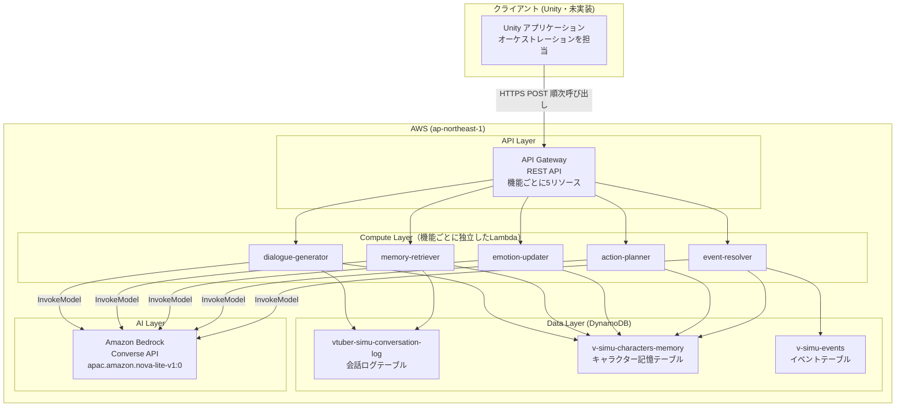
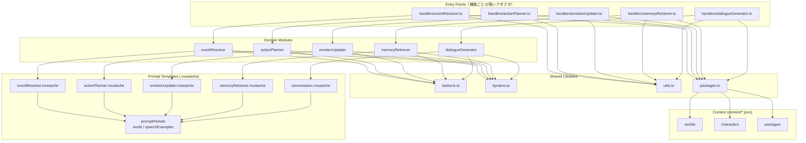
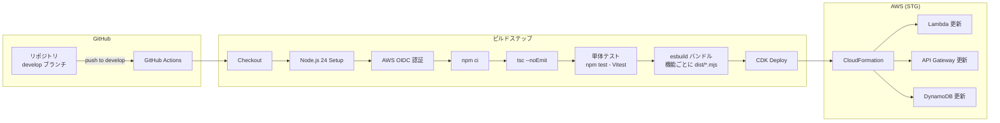
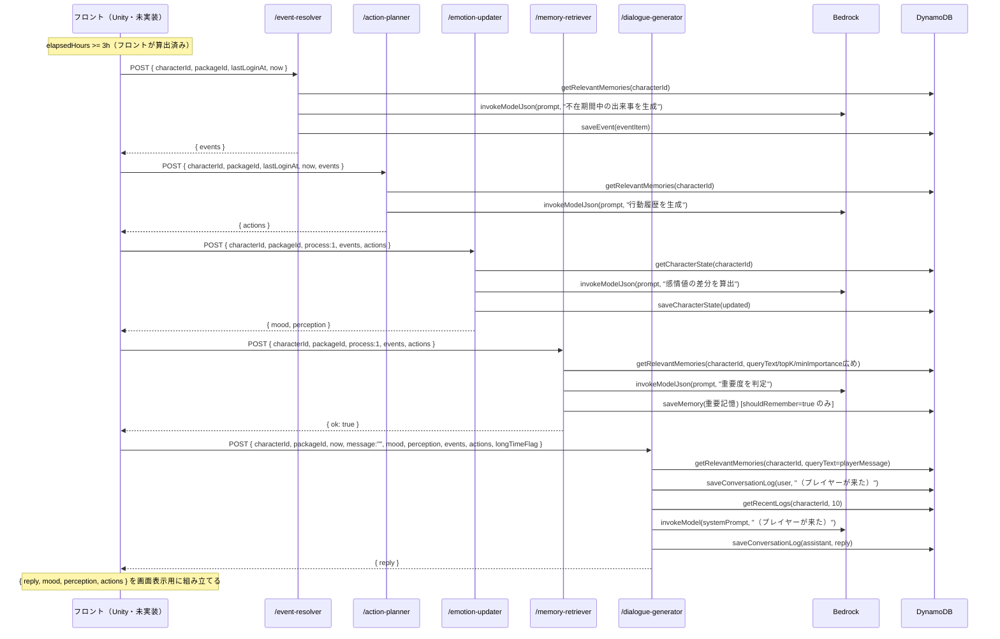
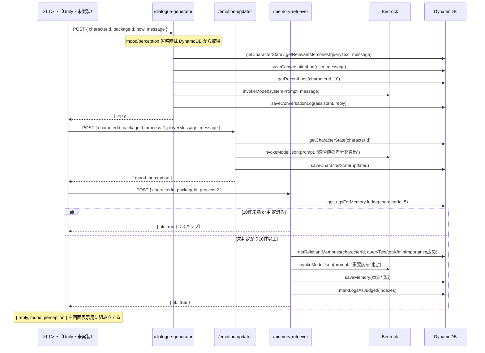
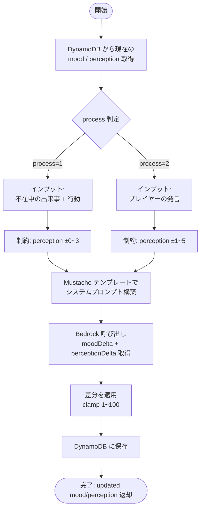
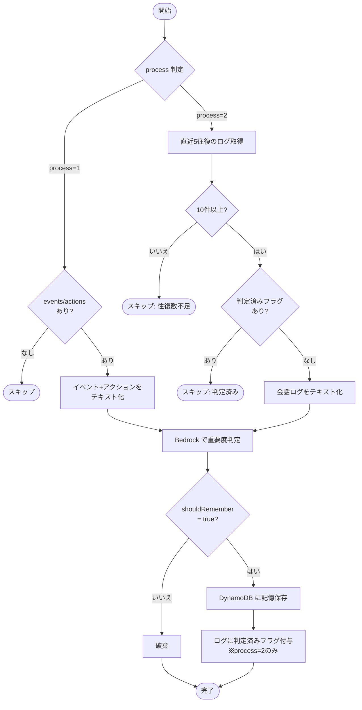

# VTuber Simulator API

VTuber キャラクターとのチャットインタラクションを提供するサーバーレス API。プレイヤーの不在時間に基づいてキャラクターの世界をシミュレートし、感情・関係値を持つキャラクターとの自然な対話を実現する。

`docs/spec/api/` 配下にあった仕様ドキュメント（overview / architecture / data-model / flow / api-spec）を、このフォルダの README に統合したもの。

## 技術スタック

| カテゴリ | 技術 |
|---------|------|
| ランタイム | Node.js 24.x (AWS Lambda) |
| 言語 | TypeScript (ESM) |
| ビルドツール | esbuild |
| テスト | Vitest（単体テスト。`test/unit/`） |
| LLM | Amazon Bedrock (Converse API) / `apac.amazon.nova-lite-v1:0` |
| データベース | Amazon DynamoDB |
| API ゲートウェイ | Amazon API Gateway (REST API) |
| IaC | AWS CDK (TypeScript) |
| CI/CD | GitHub Actions (OIDC 認証) |
| テンプレートエンジン | Mustache |
| リージョン | ap-northeast-1 (東京) |

## ディレクトリ構成

```
api/
├── .github/workflows/deploy-stg.yml   # CI/CD パイプライン（STG）
├── content/                            # キャラクター×世界観パッケージのデータ（JSON）
│   ├── worlds/                         # 世界観
│   ├── characters/                     # キャラクター（設定・口調の例文を含む）
│   ├── lifestyles/                     # 生活様式（生活リズム・出来事の種類。不在期間のシミュレーションで使用）
│   └── packages/                       # 世界観×キャラクター×生活様式の組み合わせ（フロントが選ぶ単位）
├── dist/                               # ビルド成果物（機能ごとに <name>.mjs ＋ content/ のコピー）
├── infra/                              # CDK インフラ定義
│   ├── bin/                            # CDK エントリーポイント
│   ├── lib/
│   │   ├── vtuber-simulator-stack.ts   # メインスタック（Lambda x5, API GW, DynamoDB）
│   │   └── github-oidc-stack.ts        # GitHub OIDC 認証スタック
│   ├── cdk.json / package.json / tsconfig.json
├── scripts/
│   ├── clear-tables.mjs                # テーブルクリアスクリプト
│   ├── copy-content.mjs                # content/ を dist/content/ にコピー（npm run build から実行）
│   └── test-runner.ts                  # 実AWS向けの手動実行スクリプト
├── src/
│   ├── handlers/                       # Lambda エントリーポイント（機能ごとに1ファイル）
│   │   ├── eventResolver.ts
│   │   ├── actionPlanner.ts
│   │   ├── emotionUpdater.ts
│   │   ├── memoryRetriever.ts
│   │   └── dialogueGenerator.ts
│   ├── types.ts                        # 型定義
│   ├── eventResolver/{index.ts, prompts/eventResolver.mustache}      # イベント生成
│   ├── actionPlanner/{index.ts, prompts/actionPlanner.mustache}      # 行動履歴生成
│   ├── emotionUpdater/{index.ts, prompts/emotionUpdater.mustache}    # 感情値更新
│   ├── memoryRetriever/{index.ts, prompts/memoryRetriever.mustache}  # 重要記憶管理
│   ├── dialogueGenerator/{index.ts, prompts/conversation.mustache}   # セリフ生成
│   ├── promptPartials/{index.ts, world.mustache, speechExamples.mustache}  # 5テンプレート共有のパーシャル
│   └── lib/{bedrock.ts, dynamo.ts, packages.ts, utils.ts}
├── test/
│   ├── events/                         # Lambda コンソール用のテストイベント（廃止済み `/chat` 前提のまま古い）
│   └── unit/                           # Vitest の単体テストコード（src/ と同じフォルダ構成）
├── vitest.config.ts                    # Vitest 設定（.mustache 変換プラグイン、CONTENT_DIR 等）
└── package.json
```

## アーキテクチャ

機能（`eventResolver`/`actionPlanner`/`emotionUpdater`/`memoryRetriever`/`dialogueGenerator`）ごとに独立した Lambda + API エンドポイントを公開する構成。**「どの処理をどの順で呼ぶか」を決めるオーケストレーションはバックエンドではなくフロントエンド（Unity、未実装）の責務**であり、バックエンド側にはもうプロセス分岐ロジックは存在しない（旧 `processChat.ts`/単一 `POST /chat` は廃止済み）。各 Lambda は「リクエストを受け取り、対応する機能を実行し、結果を返す」だけの薄いエンドポイントになっている。

### 主要コンポーネント

| モジュール | 役割 |
|-----------|------|
| `handlers/*.ts` | Lambda エントリーポイント（機能ごとに1ファイル）。リクエスト解析・正規化・レスポンス生成のみを行う薄いアダプタ |
| `eventResolver` | 不在期間中にキャラクターが経験したイベントを LLM で生成 |
| `actionPlanner` | イベントに基づくキャラクターの行動履歴を LLM で生成 |
| `emotionUpdater` | イベント/プレイヤー発言を元に感情・関係値を LLM で更新 |
| `memoryRetriever` | 重要な出来事・会話を LLM で判定し長期記憶として保存 |
| `dialogueGenerator` | 全情報を統合しキャラクターのセリフを LLM で生成 |
| `lib/packages.ts` | リクエストの `packageId` から、`content/` の世界観とキャラクターを読み込む |
| `promptPartials` | 世界観・口調の例文を描画する共有パーシャル。5つのテンプレートから読み込む |

### キャラクター×世界観パッケージ

キャラクター固有・世界観固有の文面はテンプレートに直書きせず、`content/` の JSON として持つ。フロントは `packageId`（世界観×キャラクターの組み合わせ）を選んで渡すだけで、キャラクターや世界観を個別に指定することはできない。

1. ハンドラーが `lib/packages.ts` の `loadRequestedPackage(packageId)` でパッケージを読み込み、世界観（`World`）とキャラクター（`CharacterDefinition`）を解決する（コンテナ内でキャッシュ）
2. 各機能の `run*` は `promptPartials/index.ts` の `buildPromptContext(world, character)` を view に展開し、`PROMPT_PARTIALS` を渡して `Mustache.render` する
3. 5つのテンプレートは `{{> world}}` で世界観を、`conversation.mustache` はさらに `{{> speechExamples}}` で口調の例文を差し込む。キャラクターの `background`（設定）は5つすべてに入る

世界観やキャラクターを追加するときは JSON を足すだけで、テンプレートとコードの変更は不要（再デプロイは必要）。データの書式は [`content/README.md`](content/README.md)、パーシャルは [`src/promptPartials/README.md`](src/promptPartials/README.md) を参照。

### フロントが組み立てる呼び出しパターン

以下はフロントが「どの状況でどのエンドポイントをどの順で呼ぶべきか」を判断する際の推奨パターン（詳細は後述の「API仕様」を参照）。

| 状況 | 条件 | 呼び出し順 |
|---------|------|---------|
| ログイン時・通常不在 | `message=""` かつ 3h <= 経過 < 2週間 | `/event-resolver` → `/action-planner` → `/emotion-updater`(process=1) → `/memory-retriever`(process=1) → `/dialogue-generator` |
| ログイン時・長期不在 | `message=""` かつ 経過 >= 2週間 | 同上 + `longTimeFlag=1` を `/dialogue-generator` に渡す（孤独感・喜び表現を追加） |
| ログイン時・短時間不在 | `message=""` かつ 経過 < 3h | どのAPIも呼ばない。固定挨拶をローカル表示 |
| 会話メッセージ送信 | `message` に内容あり | `/dialogue-generator` → `/emotion-updater`(process=2) → `/memory-retriever`(process=2)（重要記憶判定は内部で5往復ごとにスキップ判定） |

### システム構成図（AWS インフラ）



### アプリケーション内部コンポーネント構成図



### CI/CD パイプライン構成図



## リクエスト処理フロー

以下はいずれも**フロント側が実行する**呼び出し順序（=旧 `processChat.ts` が担っていた判断）。バックエンドは個々のエンドポイントを提供するのみで、この順序決定には関与しない。

### 全体フロー


### ログイン時（不在3時間以上）の呼び出しシーケンス



### 会話メッセージ送信時の呼び出しシーケンス



### emotionUpdater 内部処理フロー



### memoryRetriever 判定フロー



## データモデル（DynamoDB）

| テーブル名 | 用途 | 作成方法 |
|-----------|------|---------|
| `vtuber-simu-conversation-log-{stage}` | 会話ログ | 既存（CDK でインポート） |
| `v-simu-characters-memory-{stage}` | キャラクター記憶・状態 | 既存（CDK でインポート） |
| `v-simu-events-{stage}` | イベント履歴 | CDK で新規作成 |

```mermaid
erDiagram
    CONVERSATION_LOG {
        string conversation_id PK "キャラクターID"
        string index SK "ISO8601 タイムスタンプ"
        string role "user | assistant"
        string content "発言内容"
        number memoryRetrieverJudgedFlag "判定済み: 0 or 1"
    }
    CHARACTER_MEMORY {
        string memory_id PK "characterId"
        string index SK "state | タイムスタンプ_UUID"
        object mood "感情値 (state レコードのみ)"
        object perception "関係値 (state レコードのみ)"
        string eventSummary "記憶: 出来事の要約"
        string characterInterpretation "記憶: キャラクターの解釈"
        string[] tags "記憶: タグ"
        number importance "記憶: 重要度"
        string memoryType "記憶: 記憶タイプ"
        object relationshipChanges "記憶: 関係値変化"
        string emotion "記憶: 感情"
        string reason "記憶: 記憶理由"
        string updatedAt "更新日時"
    }
    EVENTS {
        string event_id PK "UUID"
        string characterId "キャラクターID (GSI PK)"
        string startDatetime "不在開始日時"
        string endDatetime "不在終了日時"
        string elapsed "経過時間テキスト"
        string[] events "生成されたイベント一覧"
        string createdAt "作成日時 (GSI SK)"
    }
    CHARACTER_MEMORY ||--o{ CONVERSATION_LOG : "characterId で関連"
    CHARACTER_MEMORY ||--o{ EVENTS : "characterId で関連"
```

### 会話ログテーブル

- キー: PK `conversation_id`（キャラクターID）/ SK `index`（ISO8601タイムスタンプ）
- 属性: `role`（`user`|`assistant`）, `content`, `memoryRetrieverJudgedFlag`（0/1）
- アクセスパターン: `saveConversationLog()` / `getRecentLogs(limit=10)`（降順クエリ→昇順反転）/ `getLogsForMemoryJudge(turns=5)`（直近10件）/ `markLogsAsJudged(indexes)`

### キャラクター記憶テーブル

感情状態と重要記憶の2種類を1テーブルで管理するマルチパーパステーブル。PK `memory_id`（`characterId`）/ SK `index`。状態レコードと記憶レコードは同じ `memory_id` の下に同居する。

| レコード種別 | `index` の値 | `memory_id` の値 | 用途 |
|-------------|-------------|-----------------|------|
| 状態レコード | `"state"` | characterId (UUID) | 感情値・関係値の現在値（`mood`, `perception`, `updatedAt`） |
| 記憶レコード | `{ISO8601}_{UUID8桁}` | characterId | 重要記憶（`eventSummary`, `characterInterpretation`, `tags`, `importance`, `memoryType`, `relationshipChanges`, `emotion`, `reason`, `updatedAt`） |

アクセスパターン: `getCharacterState(characterId)` / `saveCharacterState(characterId, mood, perception)` / `getRelevantMemories(characterId, { queryText?, topK?, minImportance? })` / `saveMemory(item)`

`getRelevantMemories()` は `memory_id` 配下の記憶を一旦全件取得し（`index = "state"` の状態レコードは除外）、Lambda内で「重要度 × 新しさ減衰（半減期14日）×（`queryText` 指定時は `tags` 一致数に応じたボーナス）」でスコアリングし、`minImportance`（既定20）未満を除外して上位 `topK`（既定8）件だけを返す。ベクトル検索は使っていない。呼び出し元ごとの指定値:

| 呼び出し元 | `queryText` | `topK` | `minImportance` |
|---|---|---|---|
| `eventResolver` / `actionPlanner` | なし | 8（既定） | 20（既定） |
| `dialogueGenerator` | プレイヤー発言（空文字時はなし） | 8（既定） | 20（既定） |
| `memoryRetriever`（重複記憶チェック用） | 判定対象テキスト | 20 | 10 |

2026-09-16 のパッケージ導入以前は、記憶レコードの `memory_id` にキャラクター名（例: `ゆい`）を使っていた。その時期のレコードは stg に残っているが、どこからも参照されない。

### イベントテーブル

- キー: PK `event_id`（UUID）。GSI `characterId-index`: PK `characterId` / SK `createdAt`
- 属性: `startDatetime`, `endDatetime`, `elapsed`, `events`（3〜7件のテキスト配列）, `createdAt`
- アクセスパターン: `saveEvent(item)`
- 容量: PAY_PER_REQUEST、削除ポリシーは stg=DESTROY / prod=RETAIN

### Mood（内面感情・6次元、1〜100）

| パラメータ | 日本語名 | デフォルト値 |
|-----------|---------|-------------|
| `joy` | 喜び | 35 |
| `anxiety` | 不安 | 62 |
| `angry` | 怒り | 20 |
| `fatigue` | 疲労 | 48 |
| `confidence` | 自信 | 30 |
| `loneliness` | 孤独感 | 10 |

### Perception（対プレイヤー関係値・6次元、1〜100）

| パラメータ | 日本語名 | デフォルト値 |
|-----------|---------|-------------|
| `trust` | 信頼 | 72 |
| `affection` | 好感 | 55 |
| `respect` | 尊敬 | 80 |
| `fear` | 恐れ | 12 |
| `dependence` | 依存 | 30 |
| `familiarity` | 親しみ | 65 |

値の解釈: 1〜20 ほとんど感じない / 21〜40 低い / 41〜60 標準 / 61〜80 自覚している / 81〜100 強く感じる。

更新ルール: Process 1（不在中）は mood 変化幅の制限なし・perception は ±0〜3。Process 2（会話中）は mood 制限なし・perception は ±1〜5。

## API 仕様

| 項目 | 値 |
|------|------|
| ベース URL | `https://{api-id}.execute-api.ap-northeast-1.amazonaws.com/{stage}` |
| 認証 | なし（CORS で制御、`Access-Control-Allow-Origin: *`） |
| タイムアウト | API Gateway: 29秒 / Lambda: 120秒 |

5つの独立したエンドポイントを提供する。すべて `POST`、リクエスト/レスポンスは JSON。呼び出し順序は「リクエスト処理フロー」を参照。

全エンドポイント共通のフィールド:

| フィールド | 型 | 必須 | 説明 |
|-----------|------|------|------|
| `characterId` | string | Yes | キャラクターの識別子。**「ユーザー×パッケージ」で一意**。発番はフロントの責務で、別のパッケージに切り替えるときは新しい `characterId` を発番する（重要記憶・感情状態・会話ログはすべて `characterId` 単位で保存されるため）。サーバーは `characterId` と `packageId` の対応を検証しない |
| `packageId` | string | No | キャラクター×世界観パッケージの ID（`content/packages/` 参照）。省略時は `yui-modern-tokyo`。形式が不正または存在しない場合は 400（`{"error": "unknown packageId"}`） |

キャラクターの性格・話し方・設定や世界観はパッケージ側で定義されており、リクエストで個別に指定することはできない（旧 `characterProfile` は廃止）。

### `POST /event-resolver`

不在期間中のイベントを生成する。

**リクエスト**

```json
{
  "characterId": "550e8400-e29b-41d4-a716-446655440000",
  "packageId": "yui-modern-tokyo",
  "lastLoginAt": "2026-08-10T10:00:00",
  "now": "2026-08-11T14:30:00"
}
```

| フィールド | 型 | 必須 | 説明 |
|-----------|------|------|------|
| `characterId` | string | Yes | キャラクター識別子 |
| `packageId` | string | No | 共通フィールド参照 |
| `lastLoginAt` | string (ISO8601) | No | 前回ログイン日時。省略時は `now` と同値 |
| `now` | string (ISO8601) | No | 現在日時。省略時はサーバー現在時刻 |

**レスポンス**（`EventResolverResult`）

```json
{
  "UUID": "b3f1...",
  "startDatetime": "2026-08-10T10:00:00.000Z",
  "endDatetime": "2026-08-11T14:30:00.000Z",
  "elapsed": "28時間30分",
  "events": ["テストで赤点を取って補修が大変だった"]
}
```

### `POST /action-planner`

`event-resolver` の出力（`events`）を受け取り、不在期間分（上限12時間）の行動履歴を生成する。

**リクエスト**: `event-resolver` と同じ4フィールド（`characterId` / `packageId` / `lastLoginAt` / `now`） + `events: string[]`（`event-resolver` のレスポンスの `events` をそのまま渡す）

**レスポンス**（`ActionPlannerResult`）

```json
{
  "actions": [
    { "startDatetime": "2026-08-11T08:00:00", "endDatetime": "2026-08-11T09:30:00", "action": "歌の練習", "memo": "新曲のサビを重点的に練習した" }
  ]
}
```

### `POST /emotion-updater`

`process` フィールドで process1（不在中のイベント/行動が入力）と process2（プレイヤー発言が入力）を切り替える判別ユニオン。

```json
// process = 1
{ "characterId": "...", "packageId": "yui-modern-tokyo", "process": 1, "events": [...], "actions": [...] }

// process = 2
{ "characterId": "...", "packageId": "yui-modern-tokyo", "process": 2, "playerMessage": "今日の配信、すごく良かったよ！" }
```

**レスポンス**

```json
{
  "mood": { "joy": 52, "anxiety": 45, "angry": 15, "fatigue": 38, "confidence": 35, "loneliness": 8 },
  "perception": { "trust": 74, "affection": 58, "respect": 80, "fear": 10, "dependence": 32, "familiarity": 68 }
}
```

process1 では perception の変化幅は ±0〜3、process2 では ±1〜5 に抑えるようプロンプトで指示している（詳細は「データモデル」の更新ルール参照）。

### `POST /memory-retriever`

会話・出来事を重要度判定し、該当すれば DynamoDB に記憶として保存する（副作用のみのエンドポイント）。

```json
// process = 1
{ "characterId": "...", "packageId": "yui-modern-tokyo", "process": 1, "events": [...], "actions": [...] }

// process = 2（内部で直近5往復のログを見て、10件未満または判定済みならスキップする）
{ "characterId": "...", "packageId": "yui-modern-tokyo", "process": 2 }
```

**レスポンス**: `{ "ok": true }`（判定結果は返さない。保存有無は DynamoDB の状態としてのみ反映される）

### `POST /dialogue-generator`

会話履歴・記憶・感情/関係値を踏まえてキャラクターのセリフを生成する。

**リクエスト**

```json
{
  "characterId": "550e8400-e29b-41d4-a716-446655440000",
  "packageId": "yui-modern-tokyo",
  "now": "2026-08-11T14:30:00",
  "message": "今日の配信、すごく良かったよ！",
  "mood": { "...": "..." },
  "perception": { "...": "..." },
  "events": [],
  "actions": [],
  "longTimeFlag": 0
}
```

| フィールド | 型 | 必須 | 説明 |
|-----------|------|------|------|
| `message` | string | No | `""` の場合は「プレイヤーが来た」という代替テキストで生成（ログイン時のセリフ生成に使う） |
| `mood` / `perception` | object | No | 省略時は DynamoDB の現在値を使用（会話メッセージ送信時、`emotion-updater` 呼び出し前に使うのが典型パターン） |
| `events` / `actions` | array | No | ログイン時のみ渡す。省略時は空配列扱い |
| `longTimeFlag` | 0 or 1 | No | 省略時 0 |

**レスポンス**: `{ "reply": "え、本当ですか！？ありがとうございます！実は結構緊張してたんですけど..." }`

### エラーレスポンス（全エンドポイント共通）

- **400** — `characterId` 未指定 / `process` が 1,2 以外 / 日時フォーマット不正: `{ "error": "..." }`
- **500** — サーバー内部エラー（Bedrock呼び出し失敗、DynamoDBエラー等）: `{ "error": "Failed to generate a response", "errorName": "...", "errorMessage": "..." }`

### フロント実装ガイド

呼び出し順序の詳細は「リクエスト処理フロー」を参照。実装上の注意点:

1. `event-resolver` の `events` は `action-planner`・`emotion-updater`(process1)・`memory-retriever`(process1)・`dialogue-generator` に、`action-planner` の `actions` は後続の3エンドポイントに、それぞれそのまま渡す（バックエンドはステップ間の状態を保持しない）
2. `characterId` はフロントが「ユーザー×パッケージ」ごとに発番し、そのパッケージで遊ぶ間はすべてのリクエストで使い回す。パッケージを切り替えるときは新しい `characterId` を発番する。フロントが選べるのはパッケージ（`packageId`）のみで、キャラクターや世界観を個別に指定することはできない
3. アプリ終了時の時刻を `lastLoginAt` としてローカル保存し、次回起動時に送信する
4. ログイン時（不在3時間以上）は最大5回のAPI呼び出しが直列に発生するため、体感の待ち時間は旧単一エンドポイント構成より伸びる可能性がある（トレードオフとして受け入れる前提。詳細は `.notes/api-endpoint-split-roadmap.md` の設計経緯を参照）
5. 不在3時間未満の場合はどのエンドポイントも呼ばず、直前に表示していた mood/perception をそのまま維持する（固定デフォルト値を返す挙動は廃止）

## ビルド・デプロイ

```bash
npm test                # vitest run（単体テストを1回実行）
npm run test:watch      # vitest（ウォッチモード）

npm run build          # = npm run build:bundle && npm run build:content
npm run build:bundle   # esbuild でバンドル（下記）
npm run build:content  # content/ を dist/content/ にコピー（scripts/copy-content.mjs）

# build:bundle の中身
# esbuild src/handlers/eventResolver.ts src/handlers/actionPlanner.ts src/handlers/emotionUpdater.ts \
#   src/handlers/memoryRetriever.ts src/handlers/dialogueGenerator.ts \
#   --bundle --platform=node --target=node24 --format=esm \
#   --outdir=dist --out-extension:.js=.mjs --external:@aws-sdk/* --loader:.mustache=text
```

- `.mustache` テンプレートはテキストとしてバンドルに含まれる
- `@aws-sdk/*` は Lambda ランタイムに含まれるため外部化
- `content/` は `dist/content/` にコピーされ、Lambda アセット（`dist/` 全体）に同梱される。実行時は `LAMBDA_TASK_ROOT/content` から読み込む（ソースから直接実行する場合は環境変数 `CONTENT_DIR` で指定）。パッケージを追加・変更したら再デプロイが必要

`develop` ブランチへの push で stg へ自動デプロイ: `npm ci` → `npx tsc --noEmit` → `npm test` → `npm run build` → `npx cdk deploy`（詳細は [CLAUDE.md](../CLAUDE.md) のコマンド節を参照）。単体テストが失敗すると、以降のビルド・デプロイは実行されない。

## 依存パッケージ

| パッケージ | 用途 |
|-----------|------|
| `@aws-sdk/client-bedrock-runtime` | Bedrock Converse API クライアント |
| `@aws-sdk/client-dynamodb` | DynamoDB 低レベルクライアント |
| `@aws-sdk/lib-dynamodb` | DynamoDB ドキュメントクライアント |
| `mustache` | プロンプトテンプレートエンジン |
| `@types/mustache`, `@types/node`, `esbuild`, `typescript`, `vitest`（開発依存） | 型定義・ビルドツール・単体テスト |

## 設計意図と現状のギャップ（未実装）

企画当初のドキュメントには書かれていたが、現在のコードには反映されていない設計意図。詳細と優先度は [`.notes/_followup.md`](../.notes/_followup.md) を参照。

- **AI障害時のフォールバック**（F-001）: 「Bedrock 呼び出し失敗時はデフォルトのテキストを返す」という設計意図があったが、実装は各 `handlers/*.ts` が例外を捕捉して 500 エラーを返すのみで、固定文言へのフォールバックは無い。
