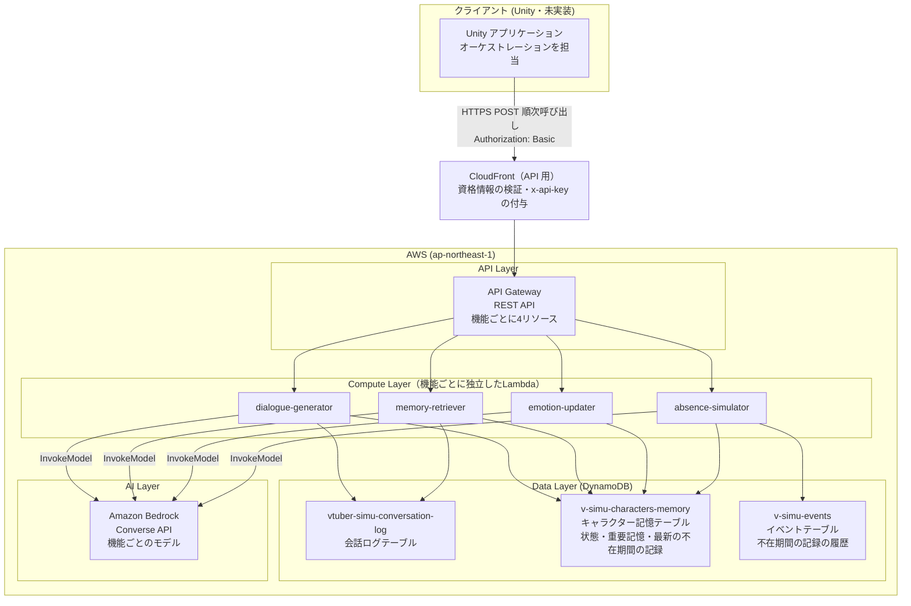
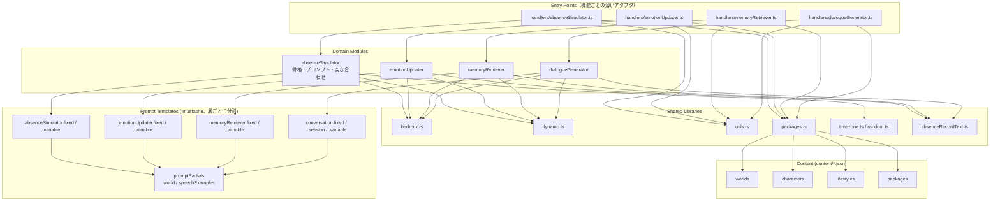
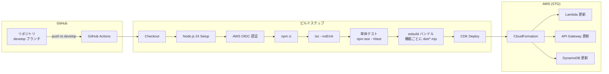
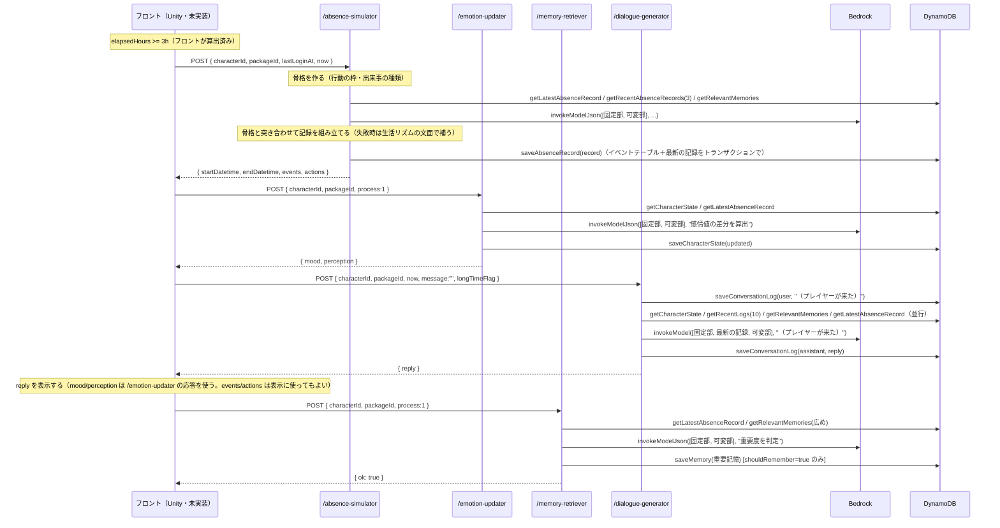
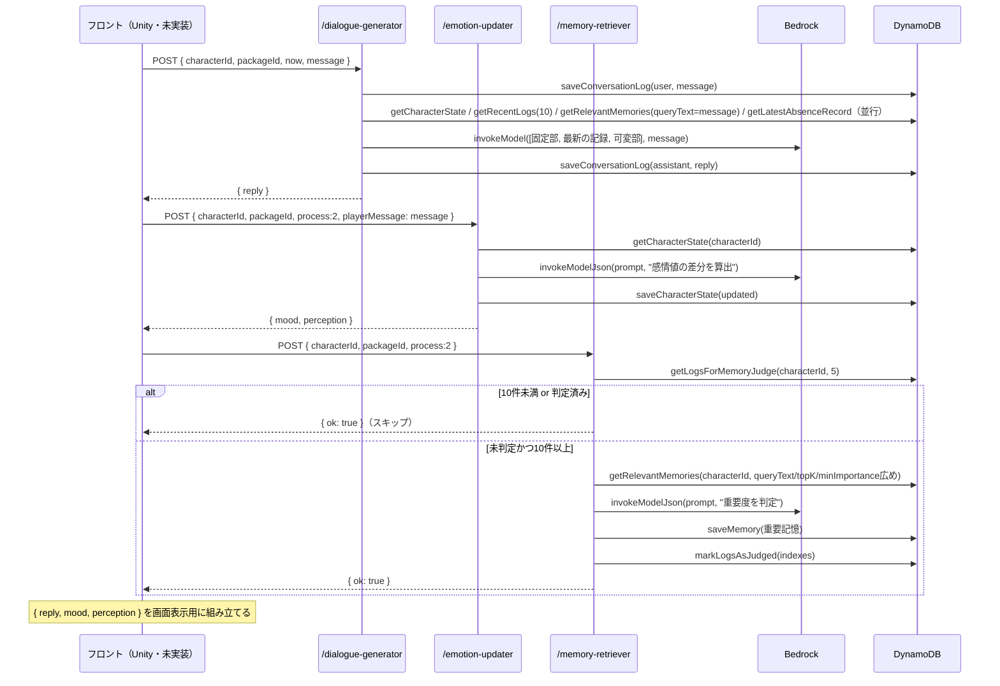
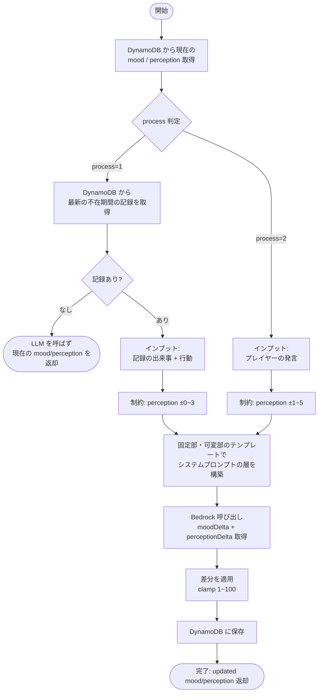

# VTuber Simulator API

VTuber キャラクターとのチャットインタラクションを提供するサーバーレス API。プレイヤーの不在時間に基づいてキャラクターの世界をシミュレートし、感情・関係値を持つキャラクターとの自然な対話を実現する。

`docs/spec/api/` 配下にあった仕様ドキュメント（overview / architecture / data-model / flow / api-spec）を、このフォルダの README に統合したもの。

## 技術スタック

| カテゴリ | 技術 |
|---------|------|
| ランタイム | Node.js 24.x (AWS Lambda) |
| 言語 | TypeScript (ESM) |
| ビルドツール | esbuild |
| テスト | Vitest（単体テスト。`test/unit/`） |
| LLM | Amazon Bedrock (Converse API)。機能ごとにモデルを使い分ける（下の「LLM のモデル」） |
| データベース | Amazon DynamoDB |
| API ゲートウェイ | Amazon API Gateway (REST API) |
| IaC | AWS CDK (TypeScript) |
| CI/CD | GitHub Actions (OIDC 認証) |
| テンプレートエンジン | Mustache |
| リージョン | ap-northeast-1 (東京) |

## ディレクトリ構成

```
api/
├── .github/workflows/deploy-stg.yml   # CI/CD パイプライン（STG）
├── content/                            # キャラクター×世界観パッケージのデータ（JSON）
│   ├── worlds/                         # 世界観
│   ├── characters/                     # キャラクター（設定・口調の例文を含む）
│   ├── lifestyles/                     # 生活様式（生活リズム・出来事の種類。不在期間のシミュレーションで使用）
│   └── packages/                       # 世界観×キャラクター×生活様式の組み合わせ（フロントが選ぶ単位）
├── dist/                               # ビルド成果物（機能ごとに <name>.mjs ＋ content/ のコピー）
├── infra/                              # CDK インフラ定義
│   ├── bin/                            # CDK エントリーポイント
│   ├── lib/
│   │   ├── vtuber-simulator-stack.ts   # メインスタック（Lambda x4, API GW, DynamoDB）
│   │   └── github-oidc-stack.ts        # GitHub OIDC 認証スタック
│   ├── cdk.json / package.json / tsconfig.json
├── scripts/
│   ├── clear-tables.mjs                # テーブルクリアスクリプト
│   ├── copy-content.mjs                # content/ を dist/content/ にコピー（npm run build から実行）
│   └── test-runner.ts                  # 実AWS向けの手動実行スクリプト
├── src/
│   ├── handlers/                       # Lambda エントリーポイント（機能ごとに1ファイル）
│   │   ├── absenceSimulator.ts
│   │   ├── emotionUpdater.ts
│   │   ├── memoryRetriever.ts
│   │   └── dialogueGenerator.ts
│   ├── types.ts                        # 型定義
│   ├── absenceSimulator/{index.ts, skeleton.ts, actionSlots.ts, eventKindSelection.ts, prompt.ts, modelOutput.ts, prompts/}  # 不在期間のシミュレーション
│   ├── emotionUpdater/{index.ts, prompt.ts, prompts/}      # 感情値更新
│   ├── memoryRetriever/{index.ts, prompt.ts, prompts/}     # 重要記憶管理
│   ├── dialogueGenerator/{index.ts, prompt.ts, prompts/}   # セリフ生成
│   ├── promptPartials/{index.ts, world.mustache, speechExamples.mustache}  # 各テンプレート共有のパーシャル
│   └── lib/{bedrock.ts, modelProfiles.ts, dynamo.ts, packages.ts, utils.ts, timezone.ts, random.ts, absenceRecordText.ts}
├── test/
│   ├── events/                         # Lambda コンソール用のテストイベント（廃止済み `/chat` 前提のまま古い）
│   ├── unit/                           # Vitest の単体テストコード（src/ と同じフォルダ構成）
│   └── ai-response/                    # AI 応答テスト（npm run test:ai。モデル・プロンプトの比較）
├── vitest.config.ts                    # Vitest 設定（.mustache 変換プラグイン、CONTENT_DIR 等）
└── package.json
```

## アーキテクチャ

機能（`absenceSimulator`/`emotionUpdater`/`memoryRetriever`/`dialogueGenerator`）ごとに独立した Lambda + API エンドポイントを公開する構成。**「どの処理をどの順で呼ぶか」を決めるオーケストレーションはバックエンドではなくフロントエンド（Unity、未実装）の責務**であり、バックエンド側にはもうプロセス分岐ロジックは存在しない（旧 `processChat.ts`/単一 `POST /chat` は廃止済み）。各 Lambda は「リクエストを受け取り、対応する機能を実行し、結果を返す」だけの薄いエンドポイントになっている。

ただし、エンドポイント間で受け渡すデータ（不在期間の出来事・行動）は DynamoDB に保存し、後段が読む。フロントは前段の出力を後段に中継しない（2026-09-19 から。経緯は [`.notes/done/absence-simulation-roadmap.md`](../.notes/done/absence-simulation-roadmap.md)）。

### 主要コンポーネント

| モジュール | 役割 |
|-----------|------|
| `handlers/*.ts` | Lambda エントリーポイント（機能ごとに1ファイル）。リクエスト解析・正規化・レスポンス生成のみを行う薄いアダプタ |
| `absenceSimulator` | 不在期間のシミュレーション。骨格（行動の枠・出来事の種類・続きの話題）をサーバーが決め、内容を LLM が書き、記録として保存する（旧 `eventResolver`・`actionPlanner` を統合） |
| `emotionUpdater` | 最新の不在期間の記録（process=1）／プレイヤー発言（process=2）を元に感情・関係値を LLM で更新 |
| `memoryRetriever` | 最新の不在期間の記録（process=1）／直近の会話（process=2）を LLM で判定し、重要な出来事を長期記憶として保存 |
| `dialogueGenerator` | 感情・関係値、重要記憶、直近の会話、最新の不在期間の記録を統合し、キャラクターのセリフを LLM で生成 |
| `lib/packages.ts` | リクエストの `packageId` から、`content/` の世界観・キャラクター・生活様式を読み込む |
| `lib/absenceRecordText.ts` | 不在期間の記録を、後段3機能のプロンプト用の文章にする |
| `promptPartials` | 世界観・口調の例文を描画する共有パーシャル。各機能の固定部のテンプレートから読み込む |

### キャラクター×世界観パッケージ

キャラクター固有・世界観固有の文面はテンプレートに直書きせず、`content/` の JSON として持つ。フロントは `packageId`（世界観×キャラクター×生活様式の組み合わせ）を選んで渡すだけで、キャラクターや世界観を個別に指定することはできない。

1. ハンドラーが `lib/packages.ts` の `loadRequestedPackage(packageId)` でパッケージを読み込み、世界観（`World`、タイムゾーンを含む）・キャラクター（`CharacterDefinition`）・生活様式（`Lifestyle`。`absenceSimulator` だけが使う）を解決する（コンテナ内でキャッシュ）
2. 各機能の `prompt.ts` は `promptPartials/index.ts` の `buildPromptContext(world, character)` を view に展開し、`PROMPT_PARTIALS` を渡して `Mustache.render` する
3. 各機能の固定部のテンプレートは `{{> world}}` で世界観を、`conversation.fixed.mustache`（`dialogueGenerator`）はさらに `{{> speechExamples}}` で口調の例文を差し込む。キャラクターの `background`（設定）はすべての機能のプロンプトに入る
4. プロンプトに出す日時は、世界観のタイムゾーンでの表記（`2026/09/18(金) 07:00`）にする

世界観やキャラクターを追加するときは JSON を足すだけで、テンプレートとコードの変更は不要（再デプロイは必要）。データの書式は [`content/README.md`](content/README.md)、パーシャルは [`src/promptPartials/README.md`](src/promptPartials/README.md) を参照。

### プロンプトの層とキャッシュ

各機能のシステムプロンプトは、変わる頻度ごとの層に分けたテンプレートから組み立て（各機能の `prompt.ts`）、`lib/bedrock.ts` が層の境目に Bedrock のプロンプトキャッシュの区切り（`cachePoint`）を入れる。キャッシュはプロンプトの先頭から一致する部分にしか効かないため、変わりにくい層から順に並べる（`.notes/decision-history.md` の D-017・D-020・D-022）。

| 層 | 内容 | 変わるタイミング | 使う機能 |
|---|---|---|---|
| ① 固定部 | 役割と指示（制約事項・出力フォーマット・思考手順）、キャラクター設定、世界観、口調の例 | パッケージやテンプレートを変えたときだけ | 全機能 |
| ② セッション部 | 最新の不在期間の記録（期間・出来事・行動・続いている話題） | 不在期間のシミュレーションを実行したとき（ログイン時）だけ | `dialogueGenerator` |
| ③ 可変部 | 現在時刻、感情・関係値、重要記憶、最近の会話、入力、出力の形式を守るよう促す一文 | 毎回 | 全機能 |

- ①には日時・感情・記録など毎回変わる値を入れない（単体テストで、入力を変えても①が同じ文字列になることを確かめている）。
- 環境変数 `PROMPT_CACHE_ENABLED=false` で区切りを入れなくなる（明示のキャッシュに対応しないモデルに変える場合のため）。
- Bedrock の応答の使用量（入力・出力・キャッシュの読み出し/書き込みのトークン数）を `[bedrock] usage ...` としてログに出す。
- 現行モデル（Nova Lite）のキャッシュの TTL は5分。区切りまでが最低トークン数（1K）に届かなくても、`absenceSimulator` の固定部（約850トークン）でキャッシュの読み出しを確認した（2026-09-19）。

### LLM のモデル

機能ごとにモデルを使い分けている（`.notes/decision-history.md` の D-024。2026-09-19 に AI 応答テストの比較をもとに決定）。モデルは CDK（`infra/lib/vtuber-simulator-stack.ts` の `ENDPOINTS[].bedrockModelId`）が Lambda ごとの環境変数 `BEDROCK_MODEL_ID` で渡し、`lib/bedrock.ts` が呼び出しのたびに読む。モデルによる呼び出し方の違い（Claude は `temperature` と `topP` を併用できない）は `lib/modelProfiles.ts` が吸収する。

| 機能 | モデル（推論プロファイル） | 理由 |
|---|---|---|
| `absenceSimulator` | Claude Haiku 4.5（`jp.anthropic.claude-haiku-4-5-20251001-v1:0`） | 行動と時間帯の整合・出来事の質が大きく上がる |
| `dialogueGenerator` | Claude Haiku 4.5（`jp.anthropic.claude-haiku-4-5-20251001-v1:0`） | キャラクターらしさの差が最も大きく、速さも保てる |
| `emotionUpdater` | Amazon Nova Lite（`apac.amazon.nova-lite-v1:0`） | 比較で最高位かつ最安 |
| `memoryRetriever` | Amazon Nova 2 Lite（`jp.amazon.nova-2-lite-v1:0`） | Claude Haiku 4.5 と同点で、料金は約4分の1 |

- モデルやプロンプトを変えるときは、AI 応答テスト（`npm run test:ai`、[`test/ai-response/README.md`](test/ai-response/README.md)）で基準と比べてから変える。
- Claude Haiku 4.5 はプロンプトがキャッシュの最低トークン数（4,096）に届かないため、プロンプトキャッシュが効かない。

### フロントが組み立てる呼び出しパターン

以下はフロントが「どの状況でどのエンドポイントをどの順で呼ぶべきか」を判断する際の推奨パターン（詳細は後述の「API仕様」を参照）。

| 状況 | 条件 | 呼び出し順 |
|---------|------|---------|
| ログイン時・通常不在 | `message=""` かつ 3h <= 経過 < 2週間 | `/absence-simulator` → `/emotion-updater`(process=1) → `/dialogue-generator` → セリフを表示 → `/memory-retriever`(process=1)（セリフの生成は `/memory-retriever` の結果を使わないので、表示の後に回して待ち時間を縮める。D-032） |
| ログイン時・長期不在 | `message=""` かつ 経過 >= 2週間 | 同上 + `longTimeFlag=1` を `/dialogue-generator` に渡す（孤独感・喜び表現を追加） |
| ログイン時・短時間不在 | `message=""` かつ 経過 < 3h | どのAPIも呼ばない。固定挨拶をローカル表示 |
| 会話メッセージ送信 | `message` に内容あり | `/dialogue-generator` → `/emotion-updater`(process=2) → `/memory-retriever`(process=2)（重要記憶判定は内部で5往復ごとにスキップ判定）。`/dialogue-generator` は毎回、最新の不在期間の記録を読むので、会話の途中でも不在中の出来事について話せる |

### システム構成図（AWS インフラ）



API 用の CloudFront・API キー・使用量プランは「API 仕様」の「アクセス制限」を参照。ブラウザのデモ（`front-web`）も、Unity と同じくこの入口から呼ぶ。

DynamoDB の権限は、`/absence-simulator` だけ実際に使う操作（キャラクター記憶テーブルの GetItem・Query・PutItem、イベントテーブルの PutItem・GSI の Query）に絞っている（D-021）。ほかの3つは CDK の `grantReadData`/`grantReadWriteData` で広めに付けたまま（`.notes/_followup.md` の F-022）。

### アプリケーション内部コンポーネント構成図



### CI/CD パイプライン構成図



## リクエスト処理フロー

以下はいずれも**フロント側が実行する**呼び出し順序（=旧 `processChat.ts` が担っていた判断）。バックエンドは個々のエンドポイントを提供するのみで、この順序決定には関与しない。

### 全体フロー


### ログイン時（不在3時間以上）の呼び出しシーケンス



### 会話メッセージ送信時の呼び出しシーケンス



### absenceSimulator 内部処理フロー


生成規則の詳細は `.notes/decision-history.md` の D-018（骨格）・D-020（突き合わせ）、実装は [`src/absenceSimulator/README.md`](src/absenceSimulator/README.md) を参照。

### emotionUpdater 内部処理フロー



### memoryRetriever 判定フロー


## データモデル（DynamoDB）

| テーブル名 | 用途 | 作成方法 |
|-----------|------|---------|
| `vtuber-simu-conversation-log-{stage}` | 会話ログ | 既存（CDK でインポート） |
| `v-simu-characters-memory-{stage}` | キャラクター記憶・状態 | 既存（CDK でインポート） |
| `v-simu-events-{stage}` | 不在期間の記録の履歴 | CDK で新規作成 |

```mermaid
erDiagram
    CONVERSATION_LOG {
        string conversation_id PK "キャラクターID"
        string index SK "ISO8601 タイムスタンプ"
        string role "user | assistant"
        string content "発言内容"
        number memoryRetrieverJudgedFlag "判定済み: 0 or 1"
    }
    CHARACTER_MEMORY {
        string memory_id PK "characterId"
        string index SK "state | absence-latest | タイムスタンプ_UUID"
        object mood "感情値 (state レコードのみ)"
        object perception "関係値 (state レコードのみ)"
        string eventSummary "記憶: 出来事の要約"
        string characterInterpretation "記憶: キャラクターの解釈"
        string[] tags "記憶: タグ"
        number importance "記憶: 重要度"
        string memoryType "記憶: 記憶タイプ"
        object relationshipChanges "記憶: 関係値変化"
        string emotion "記憶: 感情"
        string reason "記憶: 記憶理由"
        object record "最新の不在期間の記録 (absence-latest レコードのみ)"
        string updatedAt "更新日時"
    }
    EVENTS {
        string event_id PK "UUID"
        string characterId "キャラクターID (GSI PK)"
        string createdAt "作成日時 (GSI SK)"
        string startDatetime "不在期間の開始"
        string endDatetime "不在期間の終了"
        object[] events "出来事 { kind, summary, detail, threadId? }"
        object[] actions "行動 { startDatetime, endDatetime, action, memo }"
        object[] threads "続きの話題 { id, topic, status, openedAt }"
    }
    CHARACTER_MEMORY ||--o{ CONVERSATION_LOG : "characterId で関連"
    CHARACTER_MEMORY ||--o{ EVENTS : "characterId で関連"
```

### 会話ログテーブル

- キー: PK `conversation_id`（キャラクターID）/ SK `index`（ISO8601タイムスタンプ）
- 属性: `role`（`user`|`assistant`）, `content`, `memoryRetrieverJudgedFlag`（0/1）
- アクセスパターン: `saveConversationLog()` / `getRecentLogs(limit=10)`（降順クエリ→昇順反転）/ `getLogsForMemoryJudge(turns=5)`（直近10件）/ `markLogsAsJudged(indexes)`

### キャラクター記憶テーブル

感情状態と重要記憶の2種類を1テーブルで管理するマルチパーパステーブル。PK `memory_id`（`characterId`）/ SK `index`。状態レコードと記憶レコードは同じ `memory_id` の下に同居する。

| レコード種別 | `index` の値 | `memory_id` の値 | 用途 |
|-------------|-------------|-----------------|------|
| 状態レコード | `"state"` | characterId (UUID) | 感情値・関係値の現在値（`mood`, `perception`, `updatedAt`） |
| 記憶レコード | `{ISO8601}_{UUID8桁}` | characterId | 重要記憶（`eventSummary`, `characterInterpretation`, `tags`, `importance`, `memoryType`, `relationshipChanges`, `emotion`, `reason`, `updatedAt`） |
| 最新の不在期間の記録 | `"absence-latest"` | characterId | 最新の不在期間の記録（`record`: イベントテーブルに保存した `AbsenceRecord` と同じ内容、`updatedAt`）。書き込み直後でも確実に読めるよう、強い整合性の GetItem で読む（`.notes/decision-history.md` の D-019）。`absenceSimulator`（続きの話題の引き継ぎ）と、後段の3機能（`dialogueGenerator` は会話のたびに、`emotionUpdater`・`memoryRetriever` は process=1 で）が読む |

アクセスパターン: `getCharacterState(characterId)` / `saveCharacterState(characterId, mood, perception)` / `getRelevantMemories(characterId, { queryText?, topK?, minImportance? })` / `saveMemory(item)` / `getLatestAbsenceRecord(characterId)`（`saveAbsenceRecord` はイベントテーブルとこのテーブルにトランザクションで同時に書き込む）

`getRelevantMemories()` は `memory_id` 配下の記憶を一旦全件取得し（`index = "state"` の状態レコードと `index = "absence-latest"` の最新の不在期間の記録は除外）、Lambda内で「重要度 × 新しさ減衰（半減期14日）×（`queryText` 指定時は `tags` 一致数に応じたボーナス）」でスコアリングし、`minImportance`（既定20）未満を除外して上位 `topK`（既定8）件だけを返す。ベクトル検索は使っていない。呼び出し元ごとの指定値:

| 呼び出し元 | `queryText` | `topK` | `minImportance` |
|---|---|---|---|
| `absenceSimulator` | なし | 8（既定） | 20（既定） |
| `dialogueGenerator` | プレイヤー発言（空文字時はなし） | 8（既定） | 20（既定） |
| `memoryRetriever`（重複記憶チェック用） | 判定対象テキスト | 20 | 10 |

2026-09-16 のパッケージ導入以前は、記憶レコードの `memory_id` にキャラクター名（例: `ゆい`）を使っていた。その時期のレコードは stg に残っているが、どこからも参照されない。

### イベントテーブル

- キー: PK `event_id`（UUID）。GSI `characterId-index`: PK `characterId` / SK `createdAt`（射影は ALL）
- 属性（不在期間の記録 `AbsenceRecord`）: `characterId`, `createdAt`（サーバーの現在時刻）, `startDatetime`, `endDatetime`, `events`（`{ kind, summary, detail, threadId? }` の配列。`kind` は生活様式の出来事の種類、`summary` は1文の要約、`detail` は聞かれたときに話せる内容）, `actions`（`{ startDatetime, endDatetime, action, memo }` の配列）, `threads`（続きの話題 `{ id, topic, status: "open" | "closed", openedAt }` の配列。その時点で続いている話題と、今回閉じた話題）
- アクセスパターン: `saveAbsenceRecord(record)`（キャラクター記憶テーブルの `absence-latest` と同時にトランザクションで書き込む）/ `getRecentAbsenceRecords(characterId, limit)`（GSI を新しい順に読み、旧形式は読み飛ばす。足りなければ最大5ページまで続けて読む。`absenceSimulator` が「最近の出来事を繰り返さない」ために直近3件を読む）
- 旧形式（2026-09-19 に削除した `/event-resolver` が書き込んでいた `elapsed`・`events: string[]` のフラットな形）の既存データは stg に残っているが、読むときに読み飛ばす
- 容量: PAY_PER_REQUEST、削除ポリシーは stg=DESTROY / prod=RETAIN

### Mood（内面感情・6次元、1〜100）

| パラメータ | 日本語名 | デフォルト値 |
|-----------|---------|-------------|
| `joy` | 喜び | 35 |
| `anxiety` | 不安 | 62 |
| `angry` | 怒り | 20 |
| `fatigue` | 疲労 | 48 |
| `confidence` | 自信 | 30 |
| `loneliness` | 孤独感 | 10 |

### Perception（対プレイヤー関係値・6次元、1〜100）

| パラメータ | 日本語名 | デフォルト値 |
|-----------|---------|-------------|
| `trust` | 信頼 | 72 |
| `affection` | 好感 | 55 |
| `respect` | 尊敬 | 80 |
| `fear` | 恐れ | 12 |
| `dependence` | 依存 | 30 |
| `familiarity` | 親しみ | 65 |

値の解釈: 1〜20 ほとんど感じない / 21〜40 低い / 41〜60 標準 / 61〜80 自覚している / 81〜100 強く感じる。

更新ルール: Process 1（不在中）は mood 変化幅の制限なし・perception は ±0〜3。Process 2（会話中）は mood 制限なし・perception は ±1〜5。

## API 仕様

| 項目 | 値 |
|------|------|
| ベース URL | `https://{API 用の CloudFront のドメイン}`（スタックの出力 `ApiEntranceUrl`。パスにステージは付けない。例: `https://xxxx.cloudfront.net/dialogue-generator`）。API Gateway（`https://{api-id}.execute-api.ap-northeast-1.amazonaws.com/{stage}`）を直接呼ぶと、API キーが無いので 403 |
| 認証 | テスターごとの ID とパスワード（`Authorization: Basic base64(ID:パスワード)`）。API 用の CloudFront で検証する（下記「アクセス制限」）。資格情報が無い・誤っているときは 401 `{"error":"unauthorized"}` |
| CORS | ステージごとの許可先だけ（`infra/cdk.json` の `corsAllowedOrigins`。stg はブラウザのデモのドメインと `http://localhost:5173`） |
| 利用の上限 | 全体で毎秒5リクエスト（バースト10）、1日5,000リクエスト（API Gateway の使用量プラン）。超えると 429 |
| タイムアウト | API Gateway: 29秒 / Lambda: 120秒 / CloudFront のオリジンの応答: 30秒 |

4つの独立したエンドポイントを提供する。すべて `POST`、リクエスト/レスポンスは JSON。呼び出し順序は「リクエスト処理フロー」を参照。

全エンドポイント共通のフィールド:

| フィールド | 型 | 必須 | 説明 |
|-----------|------|------|------|
| `characterId` | string | Yes | キャラクターの識別子。**「ユーザー×パッケージ」で一意**。発番はフロントの責務で、別のパッケージに切り替えるときは新しい `characterId` を発番する（重要記憶・感情状態・会話ログ・不在期間の記録はすべて `characterId` 単位で保存されるため）。サーバーは `characterId` と `packageId` の対応を検証しない |
| `packageId` | string | No | キャラクター×世界観パッケージの ID（`content/packages/` 参照）。省略時は `yui-modern-tokyo`。形式が不正または存在しない場合は 400（`{"error": "unknown packageId"}`） |

キャラクターの性格・話し方・設定や世界観はパッケージ側で定義されており、リクエストで個別に指定することはできない（旧 `characterProfile` は廃止）。

### `POST /absence-simulator`

前回ログインから今回までの不在期間に、キャラクターが過ごした時間（出来事・行動・続きの話題）を生成し、記録として DynamoDB に保存する。旧 `/event-resolver`・`/action-planner` を統合したもの（2026-09-19）。

**リクエスト**

```json
{
  "characterId": "550e8400-e29b-41d4-a716-446655440000",
  "packageId": "yui-modern-tokyo",
  "lastLoginAt": "2026-09-18T13:00:00Z",
  "now": "2026-09-19T01:00:00Z"
}
```

| フィールド | 型 | 必須 | 説明 |
|-----------|------|------|------|
| `characterId` | string | Yes | キャラクター識別子 |
| `packageId` | string | No | 共通フィールド参照 |
| `lastLoginAt` | string (ISO8601) | No | 前回ログイン日時。省略時は `now` と同値。`now` より後なら 400 |
| `now` | string (ISO8601) | No | 現在日時。省略時はサーバー現在時刻 |

- 行動は、今回ログインまでの直近12時間を上限に、パッケージの生活様式（平日・休日の生活リズム）から時刻の枠を決め、LLM が中身を書く。出来事の件数（1〜5件）は不在期間全体の長さで決まる。
- LLM の呼び出しが失敗しても 500 にはせず、出来事を空、行動を生活リズムの文面にして記録を保存する（DynamoDB のエラーは 500）。

**レスポンス**（`AbsenceSimulatorResult`）

```json
{
  "startDatetime": "2026-09-18T13:00:00.000Z",
  "endDatetime": "2026-09-19T01:00:00.000Z",
  "events": [
    { "kind": "small-joy", "summary": "配信のアーカイブに初めて長文の感想がついた", "detail": "寝る前に見返していたら、…" }
  ],
  "actions": [
    { "startDatetime": "2026-09-18T13:00:00.000Z", "endDatetime": "2026-09-18T14:00:00.000Z", "action": "配信の振り返り", "memo": "…" }
  ]
}
```

フロントは表示に使ってもよいが、後段のエンドポイントに渡す必要はない（後段は保存された記録を DynamoDB から読む）。続きの話題（`threads`）はレスポンスに含めない。

### `POST /emotion-updater`

`process` フィールドで process1（最新の不在期間の記録が入力）と process2（プレイヤー発言が入力）を切り替える判別ユニオン。

```json
// process = 1（最新の不在期間の記録を DynamoDB から読む。記録が無ければ LLM を呼ばず、現在の値をそのまま返す）
{ "characterId": "...", "packageId": "yui-modern-tokyo", "process": 1 }

// process = 2
{ "characterId": "...", "packageId": "yui-modern-tokyo", "process": 2, "playerMessage": "今日の配信、すごく良かったよ！" }
```

**レスポンス**

```json
{
  "mood": { "joy": 52, "anxiety": 45, "angry": 15, "fatigue": 38, "confidence": 35, "loneliness": 8 },
  "perception": { "trust": 74, "affection": 58, "respect": 80, "fear": 10, "dependence": 32, "familiarity": 68 }
}
```

process1 では perception の変化幅は ±0〜3、process2 では ±1〜5 に抑えるようプロンプトで指示している（詳細は「データモデル」の更新ルール参照）。2026-09-19 以前の process1 はリクエストで `events`/`actions` を受け取っていたが、廃止した（送られても無視する）。

### `POST /memory-retriever`

会話・出来事を重要度判定し、該当すれば DynamoDB に記憶として保存する（副作用のみのエンドポイント）。

```json
// process = 1（最新の不在期間の記録を DynamoDB から読む。記録が無ければ何もしない）
{ "characterId": "...", "packageId": "yui-modern-tokyo", "process": 1 }

// process = 2（内部で直近5往復のログを見て、10件未満または判定済みならスキップする）
{ "characterId": "...", "packageId": "yui-modern-tokyo", "process": 2 }
```

**レスポンス**: `{ "ok": true }`（判定結果は返さない。保存有無は DynamoDB の状態としてのみ反映される）

### `POST /dialogue-generator`

会話履歴・記憶・感情/関係値・最新の不在期間の記録を踏まえてキャラクターのセリフを生成する。最新の不在期間の記録は呼び出しのたびに DynamoDB から読むので、会話の途中でも不在中の出来事について話せる。

**リクエスト**

```json
{
  "characterId": "550e8400-e29b-41d4-a716-446655440000",
  "packageId": "yui-modern-tokyo",
  "now": "2026-08-11T14:30:00",
  "message": "今日の配信、すごく良かったよ！",
  "longTimeFlag": 0
}
```

| フィールド | 型 | 必須 | 説明 |
|-----------|------|------|------|
| `message` | string | No | `""` の場合は「プレイヤーが来た」という代替テキストで生成（ログイン時のセリフ生成に使う） |
| `longTimeFlag` | 0 or 1 | No | 省略時 0 |
| `now` | string (ISO8601) | No | 現在日時（プロンプトの現在時刻）。省略時はサーバー現在時刻 |

感情値・関係値（`mood`/`perception`）は、常に DynamoDB の現在値を使う。2026-09-19 にリクエストの `mood`/`perception` を廃止した（D-032。送られてきても無視する）。

**レスポンス**: `{ "reply": "え、本当ですか！？ありがとうございます！実は結構緊張してたんですけど..." }`

### アクセス制限

2026-09-19 に追加（`.notes/api-access-control-roadmap.md`、D-025・D-027）。ブラウザのデモ（`front-web`）を第三者に公開するため、API の入口を API 専用の CloudFront に絞っている。

```
クライアント ──(Authorization: Basic)──▶ CloudFront（API 用）──(x-api-key)──▶ API Gateway ──▶ Lambda
                                          ├ CloudFront Function（infra/functions/api-auth.js）が資格情報を KeyValueStore と照合
                                          ├ Authorization は API Gateway に送らない
                                          └ CORS は許可先のオリジンだけ（レスポンスヘッダーポリシー）
```

- **資格情報:** テスターごとに ID とパスワードを発行し、KeyValueStore（`vtuber-simu-testers-{stage}`）に `ID → salt:sha256(salt + ":" + パスワード)` を登録する。登録・削除・一覧は `scripts/manage-testers.ts`（`npx tsx scripts/manage-testers.ts add <ID>` など。`scripts/README.md`）。反映に数秒かかることがある。ID に `:` は使えない。
- **API キー:** 4つの POST は API キー必須。キーの値は Secrets Manager（`vtuber-simu-api-key-{stage}`）が自動生成し、API キーと CloudFront のカスタムヘッダーの両方が CloudFormation の動的参照で使う（値はリポジトリ・テンプレート・CI のログに出ない）。値を変えたときは、参照しているリソースを更新するデプロイをしないと反映されない。CORS のプリフライト（`OPTIONS`）は API キー不要。
- **401 の CORS:** CloudFront Function が返す 401 にはレスポンスヘッダーポリシーが効かないので、関数の中で、許可先のオリジンからのリクエストにだけ `Access-Control-Allow-Origin` を付けている（付けないとブラウザが 401 を読めない）。
- **料金の監視:** AWS Budgets の予算アラートは CDK では作らない（通知先のメールアドレスをリポジトリに置かないため）。AWS コンソールの「Billing and Cost Management → Budgets」で、月額の予算とメールの通知を手動で設定する。
- 構成は `infra/lib/api-entrance.ts`、関数の仕様は `infra/functions/README.md`。

### エラーレスポンス（全エンドポイント共通）

- **400** — 入力が不正な場合: `{ "error": "..." }`。チェックは次の順に行い、最初に当てはまったものを返す。
  - body が JSON として壊れている（`invalid JSON body`）／JSON だがオブジェクトでない〔`null`・配列・数値・文字列など〕（`request body must be a JSON object`）
  - `characterId` が未指定・文字列以外・空文字（`characterId must be a non-empty string`）
  - 各エンドポイント固有のチェック: `process` が 1,2 以外（`/emotion-updater`・`/memory-retriever`）／日時フォーマット不正／`now` が `lastLoginAt` より前（`/absence-simulator`）
  - 不明な `packageId`（`unknown packageId`）
- **401** — 資格情報が無い・誤っている（API 用の CloudFront が返す）: `{ "error": "unauthorized" }`
- **403** — API Gateway を直接呼んだ（API キーが無い）
- **429** — 使用量プランの上限（スロットル・1日の上限）を超えた
- **500** — サーバー内部エラー（Bedrock呼び出し失敗、DynamoDBエラー等）: `{ "error": "Failed to generate a response", "errorName": "...", "errorMessage": "..." }`

### フロント実装ガイド

呼び出し順序の詳細は「リクエスト処理フロー」を参照。実装上の注意点:

1. 前段のレスポンスを後段に渡す必要はない。不在期間の記録は `/absence-simulator` が保存し、後段が DynamoDB から読む（`mood`/`perception` も同じで、`/dialogue-generator` は常に DynamoDB から読む。D-032）
2. `characterId` はフロントが「ユーザー×パッケージ」ごとに発番し、そのパッケージで遊ぶ間はすべてのリクエストで使い回す。パッケージを切り替えるときは新しい `characterId` を発番する。フロントが選べるのはパッケージ（`packageId`）のみで、キャラクターや世界観を個別に指定することはできない
3. アプリ終了時の時刻を `lastLoginAt` としてローカル保存し、次回起動時に送信する
4. ログイン時（不在3時間以上）はセリフの表示までに3回のAPI呼び出しが直列に発生する（`/memory-retriever` はセリフの表示の後）ため、体感の待ち時間は旧単一エンドポイント構成より伸びる可能性がある（トレードオフとして受け入れる前提。詳細は `.notes/api-endpoint-split-roadmap.md` の設計経緯を参照）
5. 不在3時間未満の場合はどのエンドポイントも呼ばず、直前に表示していた mood/perception をそのまま維持する（固定デフォルト値を返す挙動は廃止）
6. API は API 用の CloudFront の URL（スタックの出力 `ApiEntranceUrl`）で呼び、すべてのリクエストに `Authorization: Basic base64(ID:パスワード)` を付ける（ID・パスワードは UTF-8 で符号化）。401 が返ったら資格情報の入力に戻す。ブラウザから呼ぶ場合、オリジンが `infra/cdk.json` の `corsAllowedOrigins` に入っている必要がある

## ビルド・デプロイ

```bash
npm test                # vitest run（単体テストを1回実行）
npm run test:watch      # vitest（ウォッチモード）
npm run test:ai        # AI 応答テスト（実際の Bedrock を呼ぶ。test/ai-response/README.md）

npm run build          # = npm run build:bundle && npm run build:content
npm run build:bundle   # esbuild でバンドル（下記）
npm run build:content  # content/ を dist/content/ にコピー（scripts/copy-content.mjs）

# build:bundle の中身
# esbuild src/handlers/absenceSimulator.ts src/handlers/emotionUpdater.ts \
#   src/handlers/memoryRetriever.ts src/handlers/dialogueGenerator.ts \
#   --bundle --platform=node --target=node24 --format=esm \
#   --outdir=dist --out-extension:.js=.mjs --external:@aws-sdk/* --loader:.mustache=text
```

- `.mustache` テンプレートはテキストとしてバンドルに含まれる
- `@aws-sdk/*` は Lambda ランタイムに含まれるため外部化
- `content/` は `dist/content/` にコピーされ、Lambda アセット（`dist/` 全体）に同梱される。実行時は `LAMBDA_TASK_ROOT/content` から読み込む（ソースから直接実行する場合は環境変数 `CONTENT_DIR` で指定）。パッケージを追加・変更したら再デプロイが必要

CDK のテスト（`infra/` で `npm test`。API 用の入口の構成を `aws-cdk-lib/assertions` で確かめる）は、CI ではまだ実行していない。

`develop` ブランチへの push で stg へ自動デプロイ: `npm ci` → `npx tsc --noEmit` → `npm test` → `npm run build` → `npx cdk deploy`（詳細は [CLAUDE.md](../CLAUDE.md) のコマンド節を参照）。単体テストが失敗すると、以降のビルド・デプロイは実行されない。

## 依存パッケージ

| パッケージ | 用途 |
|-----------|------|
| `@aws-sdk/client-bedrock-runtime` | Bedrock Converse API クライアント |
| `@aws-sdk/client-dynamodb` | DynamoDB 低レベルクライアント |
| `@aws-sdk/lib-dynamodb` | DynamoDB ドキュメントクライアント |
| `mustache` | プロンプトテンプレートエンジン |
| `@types/mustache`, `@types/node`, `esbuild`, `typescript`, `vitest`（開発依存） | 型定義・ビルドツール・単体テスト |

## 設計意図と現状のギャップ（未実装）

企画当初のドキュメントには書かれていたが、現在のコードには反映されていない設計意図。詳細と優先度は [`.notes/_followup.md`](../.notes/_followup.md) を参照。

- **AI障害時のフォールバック**（F-001）: 「Bedrock 呼び出し失敗時はデフォルトのテキストを返す」という設計意図があったが、`/absence-simulator` 以外は、各 `handlers/*.ts` が例外を捕捉して 500 エラーを返すのみで、固定文言へのフォールバックは無い（`/absence-simulator` は生活リズムの文面で記録を作って保存する。D-020）。
